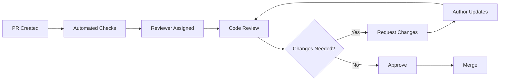

# Code Review Guidelines - GoCarbonTracker

**Version**: 1.0  
**Date**: January 22, 2025  
**Owner**: Technical Team  

## 📋 Overview

This document establishes comprehensive code review guidelines for GoCarbonTracker to ensure code quality, knowledge sharing, and team collaboration. All code changes must go through peer review before merging.

## 🎯 Code Review Objectives

### Primary Goals
- **Quality Assurance**: Maintain high code quality and consistency
- **Knowledge Sharing**: Spread knowledge across the team
- **Bug Prevention**: Catch issues before they reach production
- **Learning**: Help team members grow and improve
- **Standards Compliance**: Ensure adherence to coding standards

### Success Metrics
- **Review Coverage**: 100% of code changes reviewed
- **Review Time**: <24 hours average response time
- **Quality**: <2% post-merge bug rate
- **Team Growth**: All team members contribute to reviews

## 👥 Roles & Responsibilities

### Author Responsibilities
- Write clear, testable code
- Provide comprehensive PR descriptions
- Respond to feedback promptly
- Test changes thoroughly
- Keep PRs focused and reasonably sized

### Reviewer Responsibilities
- Provide constructive, actionable feedback
- Review within 24 hours when possible
- Understand the context and requirements
- Be thorough but pragmatic
- Approve when standards are met

### Maintainer Responsibilities
- Ensure review process is followed
- Handle conflicts and escalations
- Maintain code review standards
- Coach team on review practices

## 🔍 Review Process

### 1. Pre-Review Checklist (Author)

#### Before Creating PR
- [ ] Code follows project conventions
- [ ] All tests pass locally
- [ ] No console.log or debug statements
- [ ] Documentation updated if needed
- [ ] Self-review completed
- [ ] PR is reasonably sized (<400 lines)

#### PR Creation
- [ ] Clear, descriptive title
- [ ] Comprehensive description
- [ ] Linked to relevant issues
- [ ] Appropriate labels applied
- [ ] Reviewers assigned

### 2. Review Process Flow



### 3. Review Timeline

- **Initial Review**: Within 24 hours
- **Follow-up Reviews**: Within 8 hours
- **Emergency Reviews**: Within 2 hours
- **Large PRs**: May require 48 hours

## 📝 PR Description Template

### Required Template
```markdown
## Description
Brief summary of changes and motivation

## Type of Change
- [ ] Bug fix (non-breaking change)
- [ ] New feature (non-breaking change)
- [ ] Breaking change (fix or feature that would cause existing functionality to not work as expected)
- [ ] Documentation update
- [ ] Refactoring
- [ ] Performance improvement

## Changes Made
- Specific change 1
- Specific change 2
- Specific change 3

## Testing
- [ ] Unit tests added/updated
- [ ] Integration tests pass
- [ ] Manual testing completed
- [ ] Cross-browser testing (if UI changes)

## Screenshots (if applicable)
Add screenshots for UI changes

## Breaking Changes
List any breaking changes and migration steps

## Related Issues
Fixes #123
Closes #456

## Checklist
- [ ] Code follows style guidelines
- [ ] Self-review completed
- [ ] Documentation updated
- [ ] Tests added/updated
- [ ] No breaking changes (or marked as such)
```

## 🔬 Review Focus Areas

### 1. Functionality & Logic

#### What to Review
- **Correctness**: Does the code do what it's supposed to?
- **Edge Cases**: Are edge cases handled properly?
- **Error Handling**: Are errors caught and handled appropriately?
- **Business Logic**: Does it align with requirements?

```typescript
// ✅ Good: Proper error handling
try {
  const data = await fetchEmissionData(companyId);
  return calculateIntensity(data);
} catch (error) {
  logger.error('Failed to fetch emission data', { companyId, error });
  throw new Error('Unable to calculate emission intensity');
}

// ❌ Bad: No error handling
const data = await fetchEmissionData(companyId);
return calculateIntensity(data);
```

#### Review Questions
- Are all code paths tested?
- What happens with invalid inputs?
- Is the logic clear and understandable?
- Are there any potential race conditions?

### 2. Code Quality & Style

#### Code Structure
```typescript
// ✅ Good: Clear, single responsibility
interface EmissionCalculatorProps {
  scope1: number;
  scope2: number;
  scope3: number;
}

export const EmissionCalculator = ({ scope1, scope2, scope3 }: EmissionCalculatorProps) => {
  const total = useMemo(() => scope1 + scope2 + scope3, [scope1, scope2, scope3]);
  
  return (
    <div className="emission-calculator">
      <EmissionDisplay label="Total" value={total} />
    </div>
  );
};

// ❌ Bad: Multiple responsibilities, unclear naming
export const Calculator = (props: any) => {
  const x = props.s1 + props.s2 + props.s3;
  const y = x / props.revenue;
  
  return <div>{x} - {y}</div>;
};
```

#### Review Checklist
- [ ] Clear, descriptive variable names
- [ ] Functions have single responsibility
- [ ] Appropriate abstraction levels
- [ ] Consistent formatting
- [ ] No code duplication

### 3. Performance Considerations

#### Frontend Performance
```typescript
// ✅ Good: Optimized with useMemo
const ExpensiveChart = ({ data }: { data: EmissionData[] }) => {
  const processedData = useMemo(() => {
    return data.map(item => ({
      ...item,
      intensity: item.emissions / item.revenue
    }));
  }, [data]);
  
  return <Chart data={processedData} />;
};

// ❌ Bad: Expensive calculation on every render
const ExpensiveChart = ({ data }: { data: EmissionData[] }) => {
  const processedData = data.map(item => ({
    ...item,
    intensity: item.emissions / item.revenue
  }));
  
  return <Chart data={processedData} />;
};
```

#### Backend Performance
```typescript
// ✅ Good: Efficient database query
const getCompanyEmissions = async (companyId: string, year: number) => {
  return await supabase
    .from('emissions')
    .select('scope1, scope2, scope3')
    .eq('company_id', companyId)
    .eq('year', year)
    .single();
};

// ❌ Bad: Inefficient query
const getCompanyEmissions = async (companyId: string, year: number) => {
  const allEmissions = await supabase
    .from('emissions')
    .select('*');
  
  return allEmissions.find(e => e.company_id === companyId && e.year === year);
};
```

### 4. Security Review

#### Data Validation
```typescript
// ✅ Good: Input validation
const emissionSchema = z.object({
  scope1: z.number().min(0),
  scope2: z.number().min(0),
  scope3: z.number().min(0),
  year: z.number().min(2000).max(2030)
});

export const createEmissionRecord = async (data: unknown) => {
  const validatedData = emissionSchema.parse(data);
  // Proceed with validated data
};

// ❌ Bad: No validation
export const createEmissionRecord = async (data: any) => {
  // Direct use of unvalidated data
};
```

#### Authentication & Authorization
```typescript
// ✅ Good: Proper auth checks
export const getCompanyData = async (companyId: string, userId: string) => {
  const hasAccess = await checkUserCompanyAccess(userId, companyId);
  if (!hasAccess) {
    throw new Error('Unauthorized access to company data');
  }
  
  return await fetchCompanyData(companyId);
};

// ❌ Bad: No auth checks
export const getCompanyData = async (companyId: string) => {
  return await fetchCompanyData(companyId);
};
```

### 5. Testing Coverage

#### Test Quality
```typescript
// ✅ Good: Comprehensive test
describe('EmissionCalculator', () => {
  it('should calculate total emissions correctly', () => {
    render(
      <EmissionCalculator scope1={100} scope2={200} scope3={300} />
    );
    
    expect(screen.getByText('Total: 600 tCO₂e')).toBeInTheDocument();
  });
  
  it('should handle zero values', () => {
    render(
      <EmissionCalculator scope1={0} scope2={0} scope3={0} />
    );
    
    expect(screen.getByText('Total: 0 tCO₂e')).toBeInTheDocument();
  });
});

// ❌ Bad: Incomplete test
describe('EmissionCalculator', () => {
  it('should render', () => {
    render(<EmissionCalculator scope1={100} scope2={200} scope3={300} />);
    expect(screen.getByRole('div')).toBeInTheDocument();
  });
});
```

## 🎯 Review Standards

### Code Quality Standards

#### TypeScript Standards
- **Type Safety**: No `any` types without justification
- **Interface Design**: Clear, well-defined interfaces
- **Null Safety**: Proper handling of null/undefined
- **Generic Usage**: Appropriate use of generics

#### React Standards
- **Component Design**: Single responsibility principle
- **Hooks Usage**: Proper dependency arrays
- **Performance**: Appropriate memoization
- **Accessibility**: ARIA labels and semantic HTML

#### Backend Standards
- **Error Handling**: Comprehensive error catching
- **Input Validation**: All inputs validated
- **Database Queries**: Efficient and secure
- **API Design**: RESTful conventions

### Documentation Standards

#### Code Comments
```typescript
// ✅ Good: Explains why, not what
/**
 * Calculates emission intensity per revenue dollar.
 * Uses revenue instead of employee count for better industry comparison.
 */
const calculateIntensity = (emissions: number, revenue: number): number => {
  // Handle division by zero to prevent NaN results
  if (revenue === 0) return 0;
  return emissions / revenue;
};

// ❌ Bad: Explains what the code does (obvious)
// This function adds scope1, scope2, and scope3
const calculateTotal = (scope1: number, scope2: number, scope3: number) => {
  return scope1 + scope2 + scope3; // Returns the sum
};
```

#### API Documentation
```typescript
/**
 * Retrieves emission data for a specific company and year
 * 
 * @param companyId - Unique identifier for the company
 * @param year - The year for which to retrieve data (2000-2030)
 * @returns Promise<EmissionData> - The emission data object
 * @throws {ValidationError} When companyId is invalid
 * @throws {NotFoundError} When no data exists for the given year
 * @throws {AuthorizationError} When user lacks access to company data
 */
export const getEmissionData = async (
  companyId: string, 
  year: number
): Promise<EmissionData> => {
  // Implementation
};
```

## 📋 Review Checklists

### General Review Checklist

#### Functionality
- [ ] Code accomplishes the stated goal
- [ ] Edge cases are handled
- [ ] Error scenarios are covered
- [ ] Business logic is correct
- [ ] Performance is acceptable

#### Code Quality
- [ ] Code is readable and maintainable
- [ ] Naming is clear and consistent
- [ ] Functions have single responsibility
- [ ] No unnecessary complexity
- [ ] Proper abstraction levels

#### Testing
- [ ] Tests cover new functionality
- [ ] Tests are meaningful and comprehensive
- [ ] Test names are descriptive
- [ ] Edge cases are tested
- [ ] Mocks are appropriate

#### Security
- [ ] Input validation implemented
- [ ] Authentication/authorization checked
- [ ] No sensitive data exposed
- [ ] SQL injection prevention
- [ ] XSS prevention measures

#### Documentation
- [ ] Public APIs documented
- [ ] Complex logic explained
- [ ] README updated if needed
- [ ] Breaking changes noted

### Frontend-Specific Checklist

#### React Components
- [ ] Proper hook usage
- [ ] Appropriate key props in lists
- [ ] Accessibility considerations
- [ ] Performance optimizations
- [ ] Error boundaries where needed

#### Styling
- [ ] Responsive design maintained
- [ ] Consistent with design system
- [ ] Accessibility color contrast
- [ ] Mobile-friendly interactions

#### State Management
- [ ] State updates are immutable
- [ ] Appropriate use of local vs global state
- [ ] Effect dependencies are correct
- [ ] No memory leaks

### Backend-Specific Checklist

#### API Design
- [ ] RESTful conventions followed
- [ ] Appropriate HTTP status codes
- [ ] Consistent response formats
- [ ] Rate limiting considerations

#### Database
- [ ] Efficient queries
- [ ] Proper indexing
- [ ] Data consistency maintained
- [ ] Migration scripts included

#### Security
- [ ] Input sanitization
- [ ] SQL injection prevention
- [ ] Authentication middleware
- [ ] CORS configuration

## 💬 Review Communication

### Feedback Guidelines

#### Constructive Feedback
```markdown
# ✅ Good feedback
**Issue**: The emission calculation logic could be simplified.

**Suggestion**: Consider extracting the calculation into a utility function:
```typescript
const calculateEmissionIntensity = (emissions: number, revenue: number) => {
  return revenue === 0 ? 0 : emissions / revenue;
};
```

**Reasoning**: This makes the component more testable and reusable.

# ❌ Poor feedback
This code is bad. Fix it.
```

#### Review Comment Types
- **💡 Suggestion**: Optional improvements
- **❗ Issue**: Must be addressed before merge
- **❓ Question**: Seeking clarification
- **👍 Praise**: Acknowledging good work
- **📚 Learning**: Educational comments

### Response Guidelines

#### For Authors
- **Thank reviewers**: Acknowledge feedback positively
- **Ask for clarification**: When feedback is unclear
- **Explain decisions**: When you disagree with suggestions
- **Make requested changes**: Address all required feedback

#### For Reviewers
- **Be specific**: Point to exact lines and explain issues
- **Provide alternatives**: Suggest better approaches
- **Explain reasoning**: Help others understand the why
- **Balance criticism**: Mix suggestions with praise

## 🚀 Review Efficiency

### PR Size Guidelines

#### Optimal PR Sizes
- **Small PRs**: <100 lines (ideal)
- **Medium PRs**: 100-400 lines (acceptable)
- **Large PRs**: >400 lines (should be split)

#### Breaking Down Large Changes
```markdown
# Example: Large feature broken into smaller PRs
1. PR: Add database schema for new feature
2. PR: Implement backend API endpoints
3. PR: Create frontend components
4. PR: Add integration tests
5. PR: Update documentation
```

### Review Tools & Automation

#### GitHub Features
- **Draft PRs**: For early feedback
- **Review Requests**: Assign specific reviewers
- **Code Suggestions**: Provide exact code fixes
- **Approval Requirements**: Enforce review standards

#### Automated Checks
```yaml
# Required status checks
- Build passes
- Tests pass (>80% coverage)
- Linting passes
- Type checking passes
- Security scan passes
```

## 📊 Review Metrics

### Tracking Success

#### Key Metrics
- **Review Coverage**: 100% target
- **Review Time**: <24 hours average
- **Approval Rate**: >90% first-time approval
- **Post-merge Issues**: <2% bug rate

#### Quality Indicators
- **Comment Quality**: Constructive and actionable
- **Knowledge Sharing**: Learning opportunities identified
- **Code Consistency**: Standards maintained
- **Team Growth**: All members participating

### Continuous Improvement

#### Regular Retrospectives
- Monthly review process assessment
- Identify pain points and improvements
- Update guidelines based on learnings
- Share best practices across team

## 🛠️ Tools & Integration

### GitHub Configuration

#### Branch Protection Rules
```yaml
# .github/branch-protection.yml
protection_rules:
  main:
    required_status_checks:
      strict: true
      contexts:
        - build
        - test
        - lint
    required_pull_request_reviews:
      required_approving_review_count: 1
      dismiss_stale_reviews: true
      require_code_owner_reviews: true
    enforce_admins: true
    restrictions: null
```

#### Review Assignment
```yaml
# .github/CODEOWNERS
# Global owners
* @varun-moka @tech-lead

# Frontend specific
src/components/ @frontend-team
src/pages/ @frontend-team

# Backend specific
forum-service/ @backend-team
supabase/ @backend-team

# Documentation
docs/ @all-team
*.md @all-team
```

### Review Tools

#### Recommended Extensions
- **GitHub Pull Requests** (VS Code)
- **GitLens** (Git blame and history)
- **Code Review Tools** (GitHub CLI)

#### Automated Review Tools
- **CodeClimate**: Code quality analysis
- **SonarQube**: Security and reliability
- **ESLint**: Style and best practices
- **TypeScript**: Type checking

## 📚 Training & Resources

### Internal Resources
- [Testing Strategy Guide](./TESTING_STRATEGY.md)
- [Contributing Guidelines](../CONTRIBUTING.md)
- [Architecture Documentation](./architecture/)

### External Resources
- [Google's Code Review Guidelines](https://google.github.io/eng-practices/review/)
- [GitHub Code Review Best Practices](https://github.com/features/code-review/)
- [Effective Code Review Techniques](https://developers.redhat.com/blog/2019/07/8/10-tips-for-reviewing-code-you-dont-like)

### Team Training
- Code review workshops
- Pair programming sessions
- Mentor-mentee relationships
- Regular knowledge sharing

## ❗ Escalation Process

### When to Escalate

#### Technical Disagreements
1. **Discussion**: Try to resolve through comments
2. **Video Call**: Schedule a brief discussion
3. **Team Lead**: Involve technical lead if needed
4. **Architecture Review**: For major design decisions

#### Review Conflicts
1. **Clarification**: Ask for specific feedback
2. **Compromise**: Find middle ground solutions
3. **Team Decision**: Bring to team meeting
4. **Final Authority**: Technical lead decides

### Blocking Issues

#### Unresponsive Reviewers
- Ping after 24 hours
- Request additional reviewers
- Escalate to team lead after 48 hours

#### Urgent Changes
- Use "urgent" label
- Direct message reviewers
- Consider emergency merge process

---

**Last Updated**: January 22, 2025  
**Version**: 1.0  
**Maintained by**: Technical Team

These guidelines evolve with our team and project needs. Feedback and suggestions are always welcome!