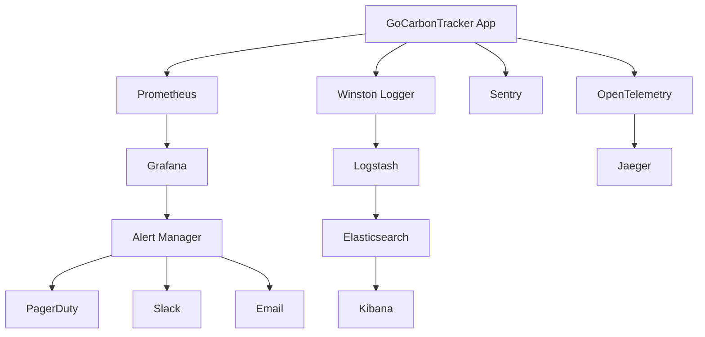

# Monitoring & Alerting Setup - GoCarbonTracker

**Version**: 1.0  
**Date**: January 22, 2025  
**Owner**: Technical Team  

## 📋 Overview

This document outlines the comprehensive monitoring and alerting strategy for GoCarbonTracker, ensuring system reliability, performance optimization, and proactive issue detection across all platform components.

## 🎯 Monitoring Objectives

### Primary Goals
- **System Health**: Monitor application and infrastructure health
- **Performance Tracking**: Track response times, throughput, and resource usage
- **Error Detection**: Identify and alert on errors and anomalies
- **User Experience**: Monitor user-facing metrics and satisfaction
- **Business Metrics**: Track feature usage and business KPIs

### Key Metrics Categories
1. **Infrastructure Metrics**: CPU, memory, disk, network
2. **Application Metrics**: Response times, error rates, throughput
3. **Business Metrics**: User engagement, feature adoption
4. **Security Metrics**: Failed logins, suspicious activities
5. **Performance Metrics**: Core Web Vitals, database performance

## 🏗️ Monitoring Architecture

### Monitoring Stack

#### Core Components
```yaml
Observability Stack:
  Metrics: Prometheus + Grafana
  Logs: Winston + ELK Stack (Elasticsearch, Logstash, Kibana)
  Tracing: OpenTelemetry + Jaeger
  Uptime: UptimeRobot / Pingdom
  Real User Monitoring: Google Analytics + Web Vitals
  Error Tracking: Sentry
  Infrastructure: Node Exporter + Cadvisor
```

#### Architecture Diagram


## 📊 Metrics Collection

### Application Metrics Setup

#### Express.js Metrics
```typescript
// metrics.ts
import promClient from 'prom-client';
import express from 'express';

// Create a Registry
const register = new promClient.Registry();

// Collect default metrics
promClient.collectDefaultMetrics({ register });

// Custom metrics
const httpRequestDuration = new promClient.Histogram({
  name: 'http_request_duration_seconds',
  help: 'Duration of HTTP requests in seconds',
  labelNames: ['method', 'route', 'status_code'],
  buckets: [0.1, 0.3, 0.5, 0.7, 1, 3, 5, 7, 10]
});

const httpRequestTotal = new promClient.Counter({
  name: 'http_requests_total',
  help: 'Total number of HTTP requests',
  labelNames: ['method', 'route', 'status_code']
});

const activeConnections = new promClient.Gauge({
  name: 'http_active_connections',
  help: 'Number of active HTTP connections'
});

const databaseQueryDuration = new promClient.Histogram({
  name: 'database_query_duration_seconds',
  help: 'Duration of database queries in seconds',
  labelNames: ['query_type', 'table'],
  buckets: [0.01, 0.05, 0.1, 0.3, 0.5, 1, 3, 5]
});

// Register metrics
register.registerMetric(httpRequestDuration);
register.registerMetric(httpRequestTotal);
register.registerMetric(activeConnections);
register.registerMetric(databaseQueryDuration);

// Middleware for HTTP metrics
export const metricsMiddleware = (req: Request, res: Response, next: NextFunction) => {
  const start = Date.now();
  
  res.on('finish', () => {
    const duration = (Date.now() - start) / 1000;
    const route = req.route?.path || req.path;
    
    httpRequestDuration
      .labels(req.method, route, res.statusCode.toString())
      .observe(duration);
    
    httpRequestTotal
      .labels(req.method, route, res.statusCode.toString())
      .inc();
  });
  
  next();
};

// Metrics endpoint
export const setupMetricsEndpoint = (app: express.Application) => {
  app.get('/metrics', async (req, res) => {
    res.set('Content-Type', register.contentType);
    res.end(await register.metrics());
  });
};
```

#### Database Metrics
```typescript
// database-metrics.ts
import { databaseQueryDuration } from './metrics';

export const instrumentQuery = async <T>(
  queryType: string,
  table: string,
  queryFn: () => Promise<T>
): Promise<T> => {
  const timer = databaseQueryDuration.startTimer({ query_type: queryType, table });
  
  try {
    const result = await queryFn();
    timer();
    return result;
  } catch (error) {
    timer();
    throw error;
  }
};

// Usage example
export const getCompanyEmissions = async (companyId: string) => {
  return instrumentQuery('SELECT', 'emissions', async () => {
    return await supabase
      .from('emissions')
      .select('*')
      .eq('company_id', companyId);
  });
};
```

#### Business Metrics
```typescript
// business-metrics.ts
import promClient from 'prom-client';

const userActions = new promClient.Counter({
  name: 'user_actions_total',
  help: 'Total user actions performed',
  labelNames: ['action_type', 'user_id', 'feature']
});

const featureUsage = new promClient.Counter({
  name: 'feature_usage_total',
  help: 'Feature usage tracking',
  labelNames: ['feature_name', 'user_type']
});

const sessionDuration = new promClient.Histogram({
  name: 'user_session_duration_seconds',
  help: 'User session duration',
  labelNames: ['user_type'],
  buckets: [60, 300, 900, 1800, 3600, 7200] // 1m to 2h
});

export const trackUserAction = (actionType: string, userId: string, feature: string) => {
  userActions.labels(actionType, userId, feature).inc();
};

export const trackFeatureUsage = (featureName: string, userType: string) => {
  featureUsage.labels(featureName, userType).inc();
};

export const trackSessionDuration = (duration: number, userType: string) => {
  sessionDuration.labels(userType).observe(duration);
};
```

### Frontend Metrics

#### Web Vitals Monitoring
```typescript
// web-vitals.ts
import { getCLS, getFID, getFCP, getLCP, getTTFB } from 'web-vitals';

interface MetricData {
  name: string;
  value: number;
  id: string;
  navigationType: string;
  rating: 'good' | 'needs-improvement' | 'poor';
}

const sendToAnalytics = (metric: MetricData) => {
  // Send to backend analytics endpoint
  fetch('/api/analytics/web-vitals', {
    method: 'POST',
    headers: { 'Content-Type': 'application/json' },
    body: JSON.stringify({
      metric: metric.name,
      value: metric.value,
      rating: metric.rating,
      page: window.location.pathname,
      timestamp: Date.now()
    })
  }).catch(console.error);
};

// Initialize Web Vitals monitoring
export const initWebVitals = () => {
  getCLS(sendToAnalytics);
  getFID(sendToAnalytics);
  getFCP(sendToAnalytics);
  getLCP(sendToAnalytics);
  getTTFB(sendToAnalytics);
};

// Custom performance tracking
export const trackPageLoad = (pageName: string) => {
  const navigationEntry = performance.getEntriesByType('navigation')[0] as PerformanceNavigationTiming;
  
  const metrics = {
    page: pageName,
    domContentLoaded: navigationEntry.domContentLoadedEventEnd - navigationEntry.domContentLoadedEventStart,
    loadComplete: navigationEntry.loadEventEnd - navigationEntry.loadEventStart,
    firstByte: navigationEntry.responseStart - navigationEntry.requestStart,
    timestamp: Date.now()
  };
  
  fetch('/api/analytics/page-performance', {
    method: 'POST',
    headers: { 'Content-Type': 'application/json' },
    body: JSON.stringify(metrics)
  }).catch(console.error);
};
```

#### React Performance Monitoring
```typescript
// react-performance.ts
import { Profiler, ProfilerOnRenderCallback } from 'react';

const onRenderCallback: ProfilerOnRenderCallback = (
  id,
  phase,
  actualDuration,
  baseDuration,
  startTime,
  commitTime,
  interactions
) => {
  // Log slow renders
  if (actualDuration > 50) {
    console.warn(`Slow render detected: ${id}`, {
      phase,
      actualDuration,
      baseDuration
    });
    
    // Send to monitoring service
    fetch('/api/analytics/slow-render', {
      method: 'POST',
      headers: { 'Content-Type': 'application/json' },
      body: JSON.stringify({
        componentId: id,
        phase,
        actualDuration,
        baseDuration,
        timestamp: Date.now()
      })
    }).catch(console.error);
  }
};

// Wrapper component for monitoring
export const MonitoredComponent: React.FC<{
  id: string;
  children: React.ReactNode;
}> = ({ id, children }) => (
  <Profiler id={id} onRender={onRenderCallback}>
    {children}
  </Profiler>
);
```

## 📝 Logging Strategy

### Structured Logging Setup

#### Backend Logging
```typescript
// logger.ts
import winston from 'winston';
import { ElasticsearchTransport } from 'winston-elasticsearch';

const logFormat = winston.format.combine(
  winston.format.timestamp(),
  winston.format.errors({ stack: true }),
  winston.format.json(),
  winston.format.printf(({ timestamp, level, message, ...meta }) => {
    return JSON.stringify({
      timestamp,
      level,
      message,
      ...meta,
      service: 'gocarbon-tracker',
      environment: process.env.NODE_ENV
    });
  })
);

const logger = winston.createLogger({
  level: process.env.LOG_LEVEL || 'info',
  format: logFormat,
  defaultMeta: { service: 'gocarbon-tracker' },
  transports: [
    // Console transport
    new winston.transports.Console({
      format: winston.format.combine(
        winston.format.colorize(),
        winston.format.simple()
      )
    }),
    
    // File transports
    new winston.transports.File({
      filename: 'logs/error.log',
      level: 'error',
      maxsize: 10485760, // 10MB
      maxFiles: 5
    }),
    new winston.transports.File({
      filename: 'logs/combined.log',
      maxsize: 10485760,
      maxFiles: 10
    }),
    
    // Elasticsearch transport (production)
    ...(process.env.NODE_ENV === 'production' ? [
      new ElasticsearchTransport({
        level: 'info',
        clientOpts: {
          node: process.env.ELASTICSEARCH_URL,
          auth: {
            username: process.env.ELASTICSEARCH_USERNAME,
            password: process.env.ELASTICSEARCH_PASSWORD
          }
        },
        index: 'gocarbon-logs'
      })
    ] : [])
  ]
});

// Request logging middleware
export const requestLogger = (req: Request, res: Response, next: NextFunction) => {
  const start = Date.now();
  
  res.on('finish', () => {
    const duration = Date.now() - start;
    
    logger.info('HTTP Request', {
      method: req.method,
      url: req.url,
      statusCode: res.statusCode,
      duration,
      userAgent: req.get('User-Agent'),
      ip: req.ip,
      userId: req.user?.id
    });
  });
  
  next();
};

export default logger;
```

#### Frontend Logging
```typescript
// frontend-logger.ts
interface LogEntry {
  level: 'info' | 'warn' | 'error';
  message: string;
  context?: Record<string, any>;
  timestamp: number;
  url: string;
  userId?: string;
}

class FrontendLogger {
  private queue: LogEntry[] = [];
  private flushInterval: number = 30000; // 30 seconds
  private maxQueueSize: number = 100;

  constructor() {
    this.startPeriodicFlush();
    this.setupErrorHandlers();
  }

  private async flush() {
    if (this.queue.length === 0) return;

    const logs = [...this.queue];
    this.queue = [];

    try {
      await fetch('/api/logs', {
        method: 'POST',
        headers: { 'Content-Type': 'application/json' },
        body: JSON.stringify({ logs })
      });
    } catch (error) {
      console.error('Failed to send logs:', error);
      // Re-queue logs if send failed
      this.queue.unshift(...logs);
    }
  }

  private startPeriodicFlush() {
    setInterval(() => this.flush(), this.flushInterval);
  }

  private setupErrorHandlers() {
    window.addEventListener('error', (event) => {
      this.error('Unhandled error', {
        message: event.error?.message,
        stack: event.error?.stack,
        filename: event.filename,
        lineno: event.lineno,
        colno: event.colno
      });
    });

    window.addEventListener('unhandledrejection', (event) => {
      this.error('Unhandled promise rejection', {
        reason: event.reason?.toString(),
        stack: event.reason?.stack
      });
    });
  }

  private log(level: LogEntry['level'], message: string, context?: Record<string, any>) {
    const entry: LogEntry = {
      level,
      message,
      context,
      timestamp: Date.now(),
      url: window.location.href,
      userId: getCurrentUserId() // Implement this function
    };

    this.queue.push(entry);

    // Console logging for development
    if (process.env.NODE_ENV === 'development') {
      console[level](message, context);
    }

    // Immediate flush for errors
    if (level === 'error' || this.queue.length >= this.maxQueueSize) {
      this.flush();
    }
  }

  info(message: string, context?: Record<string, any>) {
    this.log('info', message, context);
  }

  warn(message: string, context?: Record<string, any>) {
    this.log('warn', message, context);
  }

  error(message: string, context?: Record<string, any>) {
    this.log('error', message, context);
  }
}

export const logger = new FrontendLogger();
```

## 🚨 Alerting Configuration

### Alert Rules Setup

#### Prometheus Alert Rules
```yaml
# alert-rules.yml
groups:
  - name: gocarbon-tracker
    rules:
      # High error rate
      - alert: HighErrorRate
        expr: rate(http_requests_total{status_code=~"5.."}[5m]) > 0.1
        for: 2m
        labels:
          severity: critical
        annotations:
          summary: "High error rate detected"
          description: "Error rate is {{ $value }} errors per second"

      # High response time
      - alert: HighResponseTime
        expr: histogram_quantile(0.95, rate(http_request_duration_seconds_bucket[5m])) > 2
        for: 5m
        labels:
          severity: warning
        annotations:
          summary: "High response time detected"
          description: "95th percentile response time is {{ $value }}s"

      # Database connection issues
      - alert: DatabaseConnectionFailure
        expr: increase(database_connection_errors_total[5m]) > 5
        for: 1m
        labels:
          severity: critical
        annotations:
          summary: "Database connection failures"
          description: "{{ $value }} database connection failures in the last 5 minutes"

      # High memory usage
      - alert: HighMemoryUsage
        expr: (process_resident_memory_bytes / 1024 / 1024) > 500
        for: 10m
        labels:
          severity: warning
        annotations:
          summary: "High memory usage"
          description: "Memory usage is {{ $value }}MB"

      # Low disk space
      - alert: LowDiskSpace
        expr: (node_filesystem_avail_bytes / node_filesystem_size_bytes) * 100 < 10
        for: 5m
        labels:
          severity: critical
        annotations:
          summary: "Low disk space"
          description: "Disk space is {{ $value }}% full"
```

#### AlertManager Configuration
```yaml
# alertmanager.yml
global:
  smtp_smarthost: 'localhost:587'
  smtp_from: 'alerts@gocarbontracker.com'

route:
  group_by: ['alertname']
  group_wait: 10s
  group_interval: 10s
  repeat_interval: 1h
  receiver: 'web.hook'

receivers:
  - name: 'web.hook'
    email_configs:
      - to: 'team@gocarbontracker.com'
        subject: 'GoCarbonTracker Alert: {{ .GroupLabels.alertname }}'
        body: |
          {{ range .Alerts }}
          Alert: {{ .Annotations.summary }}
          Description: {{ .Annotations.description }}
          {{ end }}
    
    slack_configs:
      - api_url: 'https://hooks.slack.com/services/YOUR/SLACK/WEBHOOK'
        channel: '#alerts'
        title: 'GoCarbonTracker Alert'
        text: '{{ range .Alerts }}{{ .Annotations.summary }}{{ end }}'
    
    pagerduty_configs:
      - routing_key: 'YOUR_PAGERDUTY_INTEGRATION_KEY'
        description: '{{ range .Alerts }}{{ .Annotations.summary }}{{ end }}'

inhibit_rules:
  - source_match:
      severity: 'critical'
    target_match:
      severity: 'warning'
    equal: ['alertname', 'instance']
```

### Error Tracking with Sentry

#### Sentry Setup
```typescript
// sentry.ts
import * as Sentry from '@sentry/node';
import * as Tracing from '@sentry/tracing';

export const initSentry = (app: Express) => {
  Sentry.init({
    dsn: process.env.SENTRY_DSN,
    environment: process.env.NODE_ENV,
    integrations: [
      new Sentry.Integrations.Http({ tracing: true }),
      new Tracing.Integrations.Express({ app }),
      new Tracing.Integrations.Postgres()
    ],
    tracesSampleRate: 0.1,
    beforeSend(event) {
      // Filter out noisy errors
      if (event.exception) {
        const error = event.exception.values?.[0];
        if (error?.type === 'ValidationError') {
          return null; // Don't send validation errors
        }
      }
      return event;
    }
  });

  // RequestHandler creates a separate execution context using domains
  app.use(Sentry.Handlers.requestHandler());
  // TracingHandler creates a trace for every incoming request
  app.use(Sentry.Handlers.tracingHandler());
};

// Error handler (must be after all other middleware)
export const sentryErrorHandler = Sentry.Handlers.errorHandler();
```

#### Frontend Sentry Setup
```typescript
// frontend-sentry.ts
import * as Sentry from '@sentry/react';
import { BrowserTracing } from '@sentry/tracing';

export const initFrontendSentry = () => {
  Sentry.init({
    dsn: process.env.VITE_SENTRY_DSN,
    environment: process.env.NODE_ENV,
    integrations: [
      new BrowserTracing({
        routingInstrumentation: Sentry.reactRouterV6Instrumentation(
          React.useEffect,
          useLocation,
          useNavigationType,
          createRoutesFromChildren,
          matchRoutes
        ),
      }),
    ],
    tracesSampleRate: 0.1,
    beforeSend(event) {
      // Filter out development errors
      if (process.env.NODE_ENV === 'development') {
        return null;
      }
      return event;
    }
  });
};
```

## 📈 Dashboards & Visualization

### Grafana Dashboard Configuration

#### System Overview Dashboard
```json
{
  "dashboard": {
    "title": "GoCarbonTracker - System Overview",
    "panels": [
      {
        "title": "Request Rate",
        "type": "graph",
        "targets": [
          {
            "expr": "rate(http_requests_total[5m])",
            "legendFormat": "{{method}} {{route}}"
          }
        ]
      },
      {
        "title": "Error Rate",
        "type": "graph",
        "targets": [
          {
            "expr": "rate(http_requests_total{status_code=~\"5..\"}[5m])",
            "legendFormat": "5xx Errors"
          }
        ]
      },
      {
        "title": "Response Time (95th percentile)",
        "type": "graph",
        "targets": [
          {
            "expr": "histogram_quantile(0.95, rate(http_request_duration_seconds_bucket[5m]))",
            "legendFormat": "95th percentile"
          }
        ]
      },
      {
        "title": "Memory Usage",
        "type": "graph",
        "targets": [
          {
            "expr": "process_resident_memory_bytes / 1024 / 1024",
            "legendFormat": "Memory (MB)"
          }
        ]
      }
    ]
  }
}
```

#### Business Metrics Dashboard
```json
{
  "dashboard": {
    "title": "GoCarbonTracker - Business Metrics",
    "panels": [
      {
        "title": "Active Users",
        "type": "stat",
        "targets": [
          {
            "expr": "increase(user_actions_total[1h])",
            "legendFormat": "Actions/hour"
          }
        ]
      },
      {
        "title": "Feature Usage",
        "type": "graph",
        "targets": [
          {
            "expr": "rate(feature_usage_total[5m])",
            "legendFormat": "{{feature_name}}"
          }
        ]
      },
      {
        "title": "Session Duration",
        "type": "heatmap",
        "targets": [
          {
            "expr": "rate(user_session_duration_seconds_bucket[5m])",
            "legendFormat": "{{le}}"
          }
        ]
      }
    ]
  }
}
```

## 🔍 Health Checks

### Application Health Checks

#### Comprehensive Health Endpoint
```typescript
// health.ts
interface HealthCheck {
  status: 'healthy' | 'unhealthy' | 'degraded';
  timestamp: string;
  checks: {
    database: HealthStatus;
    redis: HealthStatus;
    external_apis: HealthStatus;
    disk_space: HealthStatus;
    memory: HealthStatus;
  };
  version: string;
  uptime: number;
}

interface HealthStatus {
  status: 'healthy' | 'unhealthy' | 'degraded';
  response_time?: number;
  error?: string;
  details?: any;
}

export const healthCheck = async (): Promise<HealthCheck> => {
  const checks = await Promise.allSettled([
    checkDatabase(),
    checkRedis(),
    checkExternalAPIs(),
    checkDiskSpace(),
    checkMemory()
  ]);

  const [database, redis, external_apis, disk_space, memory] = checks.map(result => 
    result.status === 'fulfilled' ? result.value : { status: 'unhealthy', error: 'Check failed' }
  );

  const overallStatus = [database, redis, external_apis, disk_space, memory]
    .some(check => check.status === 'unhealthy') ? 'unhealthy' :
    [database, redis, external_apis, disk_space, memory]
    .some(check => check.status === 'degraded') ? 'degraded' : 'healthy';

  return {
    status: overallStatus,
    timestamp: new Date().toISOString(),
    checks: { database, redis, external_apis, disk_space, memory },
    version: process.env.npm_package_version || '1.0.0',
    uptime: process.uptime()
  };
};

const checkDatabase = async (): Promise<HealthStatus> => {
  const start = Date.now();
  try {
    await supabase.from('companies').select('id').limit(1);
    return {
      status: 'healthy',
      response_time: Date.now() - start
    };
  } catch (error) {
    return {
      status: 'unhealthy',
      response_time: Date.now() - start,
      error: error.message
    };
  }
};

const checkMemory = async (): Promise<HealthStatus> => {
  const usage = process.memoryUsage();
  const usedMB = usage.heapUsed / 1024 / 1024;
  const totalMB = usage.heapTotal / 1024 / 1024;
  const usagePercent = (usedMB / totalMB) * 100;

  return {
    status: usagePercent > 90 ? 'unhealthy' : usagePercent > 80 ? 'degraded' : 'healthy',
    details: {
      heap_used_mb: Math.round(usedMB),
      heap_total_mb: Math.round(totalMB),
      usage_percent: Math.round(usagePercent)
    }
  };
};
```

### Uptime Monitoring

#### External Monitoring Setup
```typescript
// uptime-monitor.ts
import axios from 'axios';

interface UptimeCheck {
  name: string;
  url: string;
  interval: number; // seconds
  timeout: number; // seconds
  expected_status: number;
}

const uptimeChecks: UptimeCheck[] = [
  {
    name: 'Homepage',
    url: 'https://gocarbontracker.com',
    interval: 60,
    timeout: 10,
    expected_status: 200
  },
  {
    name: 'API Health',
    url: 'https://api.gocarbontracker.com/health',
    interval: 30,
    timeout: 5,
    expected_status: 200
  },
  {
    name: 'Dashboard',
    url: 'https://gocarbontracker.com/dashboard',
    interval: 120,
    timeout: 15,
    expected_status: 200
  }
];

class UptimeMonitor {
  private intervals: Map<string, NodeJS.Timeout> = new Map();

  start() {
    uptimeChecks.forEach(check => {
      const interval = setInterval(() => {
        this.performCheck(check);
      }, check.interval * 1000);
      
      this.intervals.set(check.name, interval);
    });
  }

  stop() {
    this.intervals.forEach(interval => clearInterval(interval));
    this.intervals.clear();
  }

  private async performCheck(check: UptimeCheck) {
    const start = Date.now();
    try {
      const response = await axios.get(check.url, {
        timeout: check.timeout * 1000,
        validateStatus: status => status === check.expected_status
      });

      const responseTime = Date.now() - start;
      
      // Log successful check
      logger.info('Uptime check passed', {
        check: check.name,
        url: check.url,
        response_time: responseTime,
        status_code: response.status
      });

      // Send metric
      uptimeCheckDuration.labels(check.name, 'success').observe(responseTime / 1000);
      
    } catch (error) {
      const responseTime = Date.now() - start;
      
      // Log failed check
      logger.error('Uptime check failed', {
        check: check.name,
        url: check.url,
        response_time: responseTime,
        error: error.message
      });

      // Send metric
      uptimeCheckDuration.labels(check.name, 'failure').observe(responseTime / 1000);
      
      // Send alert
      await this.sendAlert(check, error);
    }
  }

  private async sendAlert(check: UptimeCheck, error: any) {
    // Send to alerting system
    // Implementation depends on your alerting setup
  }
}

export const uptimeMonitor = new UptimeMonitor();
```

## 📱 Incident Response

### Incident Management Process

#### Incident Classification
```yaml
Severity Levels:
  P0 - Critical:
    - System completely down
    - Data loss or corruption
    - Security breach
    - Response Time: 15 minutes
    
  P1 - High:
    - Major feature unavailable
    - Significant performance degradation
    - Response Time: 1 hour
    
  P2 - Medium:
    - Minor feature issues
    - Workarounds available
    - Response Time: 4 hours
    
  P3 - Low:
    - Cosmetic issues
    - Enhancement requests
    - Response Time: 24 hours
```

#### Incident Response Playbook
```typescript
// incident-response.ts
interface Incident {
  id: string;
  severity: 'P0' | 'P1' | 'P2' | 'P3';
  title: string;
  description: string;
  status: 'open' | 'investigating' | 'resolved' | 'closed';
  assignee: string;
  created_at: Date;
  resolved_at?: Date;
  timeline: IncidentEvent[];
}

interface IncidentEvent {
  timestamp: Date;
  type: 'created' | 'updated' | 'escalated' | 'resolved';
  description: string;
  user: string;
}

class IncidentManager {
  async createIncident(data: Partial<Incident>): Promise<Incident> {
    const incident: Incident = {
      id: generateId(),
      severity: data.severity || 'P2',
      title: data.title || 'Untitled Incident',
      description: data.description || '',
      status: 'open',
      assignee: data.assignee || 'on-call-engineer',
      created_at: new Date(),
      timeline: []
    };

    // Add creation event
    incident.timeline.push({
      timestamp: new Date(),
      type: 'created',
      description: `Incident created: ${incident.title}`,
      user: 'system'
    });

    // Send notifications based on severity
    await this.sendNotifications(incident);

    // Store in database
    await this.storeIncident(incident);

    return incident;
  }

  private async sendNotifications(incident: Incident) {
    switch (incident.severity) {
      case 'P0':
        await this.sendPagerDutyAlert(incident);
        await this.sendSlackAlert(incident, '#critical-alerts');
        await this.sendEmailAlert(incident, 'critical-team@company.com');
        break;
      
      case 'P1':
        await this.sendSlackAlert(incident, '#alerts');
        await this.sendEmailAlert(incident, 'engineering-team@company.com');
        break;
      
      case 'P2':
      case 'P3':
        await this.sendSlackAlert(incident, '#alerts');
        break;
    }
  }
}
```

## 🔄 Continuous Monitoring

### Automated Monitoring Setup

#### GitHub Actions for Monitoring
```yaml
# .github/workflows/monitoring.yml
name: Continuous Monitoring

on:
  schedule:
    - cron: '*/5 * * * *'  # Every 5 minutes
  workflow_dispatch:

jobs:
  health-check:
    runs-on: ubuntu-latest
    steps:
      - name: Health Check
        run: |
          response=$(curl -s -o /dev/null -w "%{http_code}" https://gocarbontracker.com/health)
          if [ $response -ne 200 ]; then
            echo "Health check failed with status $response"
            exit 1
          fi

  performance-check:
    runs-on: ubuntu-latest
    steps:
      - name: Lighthouse Performance Check
        uses: treosh/lighthouse-ci-action@v9
        with:
          urls: |
            https://gocarbontracker.com
            https://gocarbontracker.com/dashboard
          configPath: ./lighthouserc.json
          uploadArtifacts: true
```

### Monitoring Automation Scripts

#### Daily Health Report
```bash
#!/bin/bash
# daily-health-report.sh

DATE=$(date +"%Y-%m-%d")
REPORT_FILE="/tmp/health-report-$DATE.json"

echo "Generating daily health report for $DATE"

# Collect metrics from Prometheus
curl -s "http://prometheus:9090/api/v1/query?query=rate(http_requests_total[24h])" | jq '.data.result' > "$REPORT_FILE"

# Check error rates
ERROR_RATE=$(curl -s "http://prometheus:9090/api/v1/query?query=rate(http_requests_total{status_code=~\"5..\"}[24h])" | jq -r '.data.result[0].value[1]')

# Check average response time
AVG_RESPONSE_TIME=$(curl -s "http://prometheus:9090/api/v1/query?query=rate(http_request_duration_seconds_sum[24h])/rate(http_request_duration_seconds_count[24h])" | jq -r '.data.result[0].value[1]')

# Generate report
cat << EOF > "/tmp/daily-report-$DATE.md"
# Daily Health Report - $DATE

## Key Metrics
- Error Rate: ${ERROR_RATE:-0}%
- Average Response Time: ${AVG_RESPONSE_TIME:-0}s
- Total Requests: $(curl -s "http://prometheus:9090/api/v1/query?query=increase(http_requests_total[24h])" | jq -r '.data.result[0].value[1]')

## System Health
$(curl -s https://gocarbontracker.com/health | jq .)

## Alerts in Last 24h
$(curl -s "http://alertmanager:9093/api/v1/alerts" | jq '.data[] | select(.startsAt > "'$(date -d '24 hours ago' -Iseconds)'")')
EOF

# Send report via email or Slack
# Implementation depends on your notification setup
```

---

**Last Updated**: January 22, 2025  
**Version**: 1.0  
**Maintained by**: Technical Team

Monitoring and alerting are critical for maintaining system reliability. Regular reviews and updates ensure continued effectiveness.