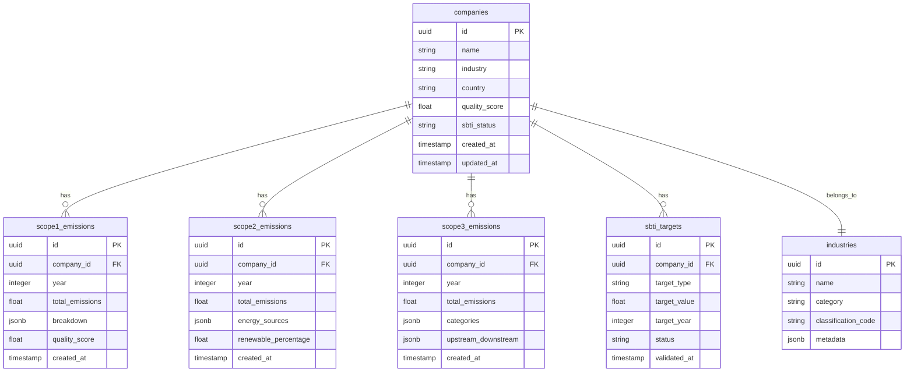

# 🏗️ System Architecture Overview

**Visual guide to GoCarbonTracker's technical architecture**

## High-Level System Architecture

## Data Flow Architecture

```mermaid
sequenceDiagram
    participant U as 👤 User
    participant F as ⚛️ Frontend
    participant Q as 🗂️ Query Cache
    participant S as 🗄️ Supabase
    participant DB as 🐘 Database
    participant RT as ⚡ Real-time
    
    Note over U,RT: Initial Page Load
    U->>F: Navigate to Dashboard
    F->>S: Check Authentication
    S-->>F: Session Status
    
    F->>Q: Check Cache
    Q-->>F: Cache Miss
    
    F->>S: Fetch Companies Data
    S->>DB: Execute Query with RLS
    DB-->>S: Return Filtered Data
    S-->>F: JSON Response
    
    F->>Q: Store in Cache
    F-->>U: Render Dashboard
    
    Note over U,RT: Real-time Updates
    RT-->>F: Data Change Event
    F->>Q: Invalidate Cache
    F->>S: Refetch Updated Data
    S->>DB: Fresh Query
    DB-->>S: Updated Data
    S-->>F: New Data
    F-->>U: Live Update
```

## Component Architecture

```mermaid
graph TD
    subgraph "Application Shell"
        App[📱 App.tsx]
        Layout[🏗️ Layout Component]
        Sidebar[📋 Sidebar Navigation]
        Header[🎯 Header Component]
    end
    
    subgraph "Page Components"
        Dashboard[📊 Dashboard]
        Analysis[📈 Analysis Pages]
        Community[🤝 Community Forum]
        Reports[📋 Reports]
    end
    
    subgraph "Feature Components"
        Charts[📊 Chart Components]
        Tables[📝 Data Tables]
        Filters[🔍 Filter Controls]
        Search[🔎 Search Interface]
    end
    
    subgraph "UI Components"
        Button[🔘 Button]
        Card[🃏 Card]
        Dialog[💬 Dialog]
        Form[📝 Form Controls]
    end
    
    subgraph "Data Layer"
        Hooks[🎣 Custom Hooks]
        Services[⚙️ API Services]
        Utils[🛠️ Utilities]
        Types[📝 TypeScript Types]
    end
    
    App --> Layout
    Layout --> Sidebar
    Layout --> Header
    Layout --> Dashboard
    Layout --> Analysis
    Layout --> Community
    Layout --> Reports
    
    Dashboard --> Charts
    Dashboard --> Tables
    Analysis --> Charts
    Analysis --> Filters
    
    Charts --> Button
    Tables --> Card
    Filters --> Form
    Search --> Dialog
    
    Dashboard --> Hooks
    Analysis --> Services
    Community --> Utils
    Reports --> Types
    
    style App fill:#e3f2fd
    style Dashboard fill:#e8f5e8
    style Charts fill:#fff3e0
    style Hooks fill:#f3e5f5
```

## Database Schema Overview

## Security Architecture

```mermaid
graph TB
    subgraph "Frontend Security"
        CSP[🛡️ Content Security Policy]
        HTTPS[🔒 HTTPS Enforcement]
        SRI[🔐 Subresource Integrity]
        Auth_UI[👤 Auth UI Components]
    end
    
    subgraph "API Security"
        RLS[🛡️ Row Level Security]
        JWT[🎫 JWT Tokens]
        CORS[🌐 CORS Policy]
        Rate[⏱️ Rate Limiting]
    end
    
    subgraph "Database Security"
        Encryption[🔒 Data Encryption]
        Backup[💾 Encrypted Backups]
        Audit[📋 Audit Logs]
        Permissions[👥 Role-based Access]
    end
    
    subgraph "Infrastructure Security"
        WAF[🛡️ Web Application Firewall]
        DDoS[🛡️ DDoS Protection]
        SSL[🔒 SSL Certificates]
        Monitoring[👁️ Security Monitoring]
    end
    
    CSP --> Auth_UI
    HTTPS --> JWT
    Auth_UI --> RLS
    JWT --> Permissions
    
    RLS --> Encryption
    Rate --> Backup
    CORS --> Audit
    
    Encryption --> WAF
    Backup --> DDoS
    Audit --> SSL
    Permissions --> Monitoring
    
    style CSP fill:#ffebee
    style RLS fill:#e8f5e8
    style Encryption fill:#e3f2fd
    style WAF fill:#fff3e0
```

## Performance Architecture

```mermaid
graph LR
    subgraph "Frontend Performance"
        Lazy[🚀 Lazy Loading]
        Split[📦 Code Splitting]
        Cache[💾 Browser Cache]
        Compress[🗜️ Asset Compression]
    end
    
    subgraph "API Performance"
        Query_Opt[⚡ Query Optimization]
        Connection_Pool[🔄 Connection Pooling]
        Response_Cache[📊 Response Caching]
        Pagination[📄 Smart Pagination]
    end
    
    subgraph "Database Performance"
        Indexes[📊 Strategic Indexes]
        Partitioning[🗂️ Table Partitioning]
        Read_Replicas[📖 Read Replicas]
        Query_Cache[⚡ Query Cache]
    end
    
    subgraph "Infrastructure Performance"
        CDN[📡 Global CDN]
        Load_Balancer[⚖️ Load Balancing]
        Auto_Scale[📈 Auto Scaling]
        Monitoring[📊 Performance Monitoring]
    end
    
    Lazy --> Query_Opt
    Split --> Connection_Pool
    Cache --> Response_Cache
    Compress --> Pagination
    
    Query_Opt --> Indexes
    Connection_Pool --> Partitioning
    Response_Cache --> Read_Replicas
    Pagination --> Query_Cache
    
    Indexes --> CDN
    Partitioning --> Load_Balancer
    Read_Replicas --> Auto_Scale
    Query_Cache --> Monitoring
    
    style Lazy fill:#e1f5fe
    style Query_Opt fill:#e8f5e8
    style Indexes fill:#fff3e0
    style CDN fill:#f3e5f5
```

## Deployment Architecture

```mermaid
graph TB
    subgraph "Development"
        Dev_Code[💻 Development Code]
        Dev_DB[🗄️ Dev Database]
        Local_Test[🧪 Local Testing]
    end
    
    subgraph "CI/CD Pipeline"
        GitHub[📁 GitHub Repository]
        Actions[⚡ GitHub Actions]
        Tests[🧪 Automated Tests]
        Build[🏗️ Build Process]
    end
    
    subgraph "Staging Environment"
        Stage_App[🎭 Staging App]
        Stage_DB[🗄️ Staging Database]
        Integration[🔗 Integration Tests]
    end
    
    subgraph "Production Environment"
        Prod_App[🚀 Production App]
        Prod_DB[🗄️ Production Database]
        CDN_Prod[📡 Production CDN]
        Monitor[📊 Monitoring]
    end
    
    Dev_Code --> GitHub
    Dev_DB --> Stage_DB
    Local_Test --> Tests
    
    GitHub --> Actions
    Actions --> Tests
    Tests --> Build
    Build --> Stage_App
    
    Stage_App --> Integration
    Stage_DB --> Integration
    Integration --> Prod_App
    
    Prod_App --> CDN_Prod
    Prod_DB --> Monitor
    CDN_Prod --> Monitor
    
    style Dev_Code fill:#e3f2fd
    style Actions fill:#e8f5e8
    style Stage_App fill:#fff3e0
    style Prod_App fill:#e8f5e8
```

## Technology Stack

### **Frontend Technologies**

### **Backend Technologies**

## Scalability Considerations

### **Horizontal Scaling**
- **Database**: Read replicas for query distribution
- **Application**: Stateless frontend allows multiple instances
- **CDN**: Global content distribution
- **Caching**: Multi-layer caching strategy

### **Vertical Scaling**
- **Database**: Optimized queries and indexing
- **Memory**: Efficient state management
- **CPU**: Code splitting and lazy loading
- **Storage**: Compressed assets and optimized images

### **Performance Monitoring**
- **Real User Monitoring (RUM)**: Track actual user experience
- **Application Performance Monitoring (APM)**: Server-side metrics
- **Database Monitoring**: Query performance and bottlenecks
- **Infrastructure Monitoring**: System resources and availability

---

*This architecture supports the current scale of 112+ companies and 185+ industries while providing a foundation for future growth to thousands of companies and advanced analytics features.*