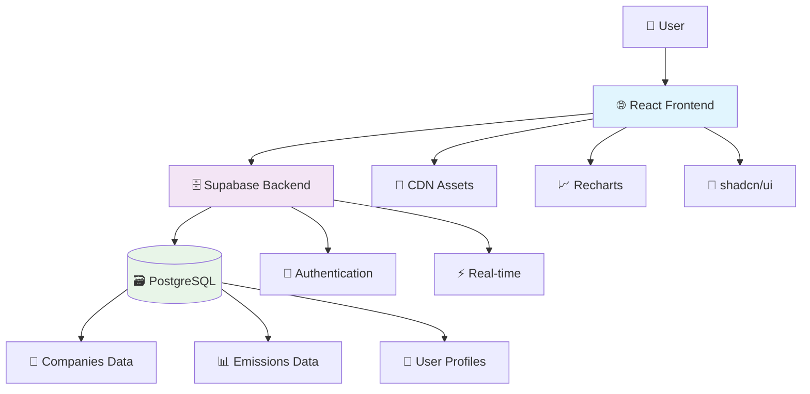
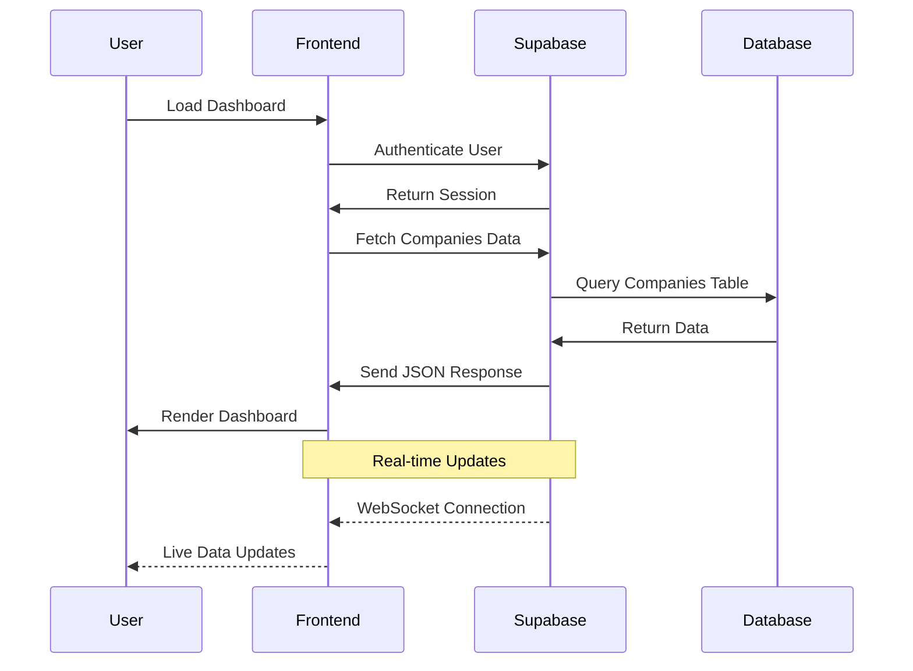
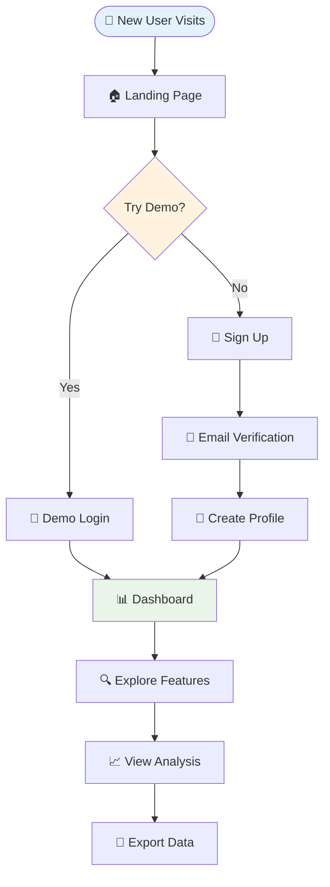
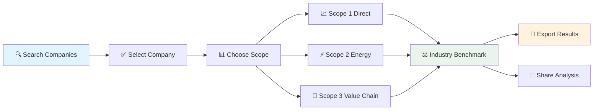

# 📸 Documentation Assets

**Visual assets for GoCarbonTracker documentation**

## Directory Structure

```
docs/assets/
├── screenshots/          # Application screenshots
│   ├── dashboard/       # Dashboard views
│   ├── analysis/        # Analysis page captures  
│   ├── community/       # Community forum screens
│   └── onboarding/      # User onboarding flow
├── diagrams/            # System architecture diagrams
│   ├── system-overview/ # High-level architecture
│   ├── data-flow/       # Data flow diagrams
│   └── user-journey/    # User experience flows
├── icons/               # Documentation icons and badges
└── mockups/             # UI mockups and wireframes
```

## Screenshots Guidelines

### **Naming Convention**
```
{page-name}_{view-type}_{state}.png

Examples:
- dashboard_main_default.png
- dashboard_main_with-data.png
- analysis_scope1_chart-view.png
- community_topic_thread-view.png
```

### **Screenshot Standards**
- **Resolution**: 1920x1080 minimum for desktop views
- **Format**: PNG for UI screenshots, JPG for photos
- **Browser**: Use Chrome with clean session (no extensions visible)
- **Zoom**: 100% browser zoom
- **Annotations**: Use red arrows/boxes for highlighting key features

### **Required Screenshots**

#### **Dashboard (Priority: High)**
- [ ] `dashboard_main_overview.png` - Main dashboard with all widgets
- [ ] `dashboard_stats_cards.png` - Global statistics cards closeup
- [ ] `dashboard_companies_table.png` - Featured companies table
- [ ] `dashboard_search_active.png` - Search functionality in use
- [ ] `dashboard_mobile_responsive.png` - Mobile view

#### **Analysis Pages (Priority: High)**
- [ ] `analysis_scope1_chart.png` - Scope 1 emissions chart
- [ ] `analysis_scope2_breakdown.png` - Scope 2 energy breakdown
- [ ] `analysis_scope3_categories.png` - Scope 3 category view
- [ ] `analysis_industry_benchmarking.png` - Industry comparison
- [ ] `analysis_trends_timeline.png` - Multi-year trends

#### **User Interface Elements (Priority: Medium)**
- [ ] `ui_navigation_sidebar.png` - Main navigation
- [ ] `ui_search_global.png` - Global search interface
- [ ] `ui_filters_advanced.png` - Advanced filtering options
- [ ] `ui_export_data.png` - Data export functionality
- [ ] `ui_theme_dark.png` - Dark theme example

## System Diagrams

### **Architecture Diagrams (Text-based)**

#### **System Overview**


#### **Data Flow Architecture**


### **User Journey Flows**

#### **New User Onboarding**


#### **Data Analysis Workflow**


## Icon Library

### **Status Indicators**
- 🟢 **High Quality Data** (Quality Score ≥ 0.8)
- 🟡 **Medium Quality Data** (Quality Score 0.6-0.8)
- 🔴 **Low Quality Data** (Quality Score < 0.6)
- ✅ **SBTi Committed** - Science-based targets set
- 🎯 **SBTi Validated** - Targets approved by SBTi
- 📈 **Trend Improving** - Emissions decreasing
- 📉 **Trend Concerning** - Emissions increasing

### **Feature Icons**
- 📊 **Dashboard** - Main overview
- 📈 **Analysis** - Data analysis tools
- 🏭 **Industries** - Industry classification
- 📋 **Reports** - Generated reports
- 🎯 **Tracking** - Emissions tracking
- 🔍 **Search** - Data search and filtering
- 🤝 **Community** - Forum and discussions
- ⚙️ **Settings** - Configuration options

## Implementation Notes

### **Screenshot Capture Process**
1. **Setup Environment**
   - Use incognito/private browsing
   - Clear browser data
   - Set viewport to 1920x1080
   - Use demo account for consistent data

2. **Capture Guidelines**
   - Include relevant browser chrome (address bar)
   - Ensure consistent lighting/contrast
   - Avoid cursor in screenshots
   - Use consistent window size

3. **Post-Processing**
   - Crop to remove unnecessary browser elements
   - Add annotations using tools like Snagit or Figma
   - Compress images (aim for <500KB per screenshot)
   - Use descriptive filenames

### **Diagram Creation Tools**
- **Mermaid.js** - For text-based diagrams (preferred)
- **Figma** - For complex UI mockups
- **Lucidchart** - For detailed system diagrams
- **Draw.io** - Free alternative for diagrams

### **Asset Optimization**
- **Images**: Optimize with tools like TinyPNG
- **SVGs**: Use for scalable icons and simple diagrams
- **Alt Text**: Always include descriptive alt text
- **Lazy Loading**: Consider lazy loading for large images

---

*Visual assets significantly improve documentation usability. Prioritize screenshots of core user flows and system architecture diagrams.*