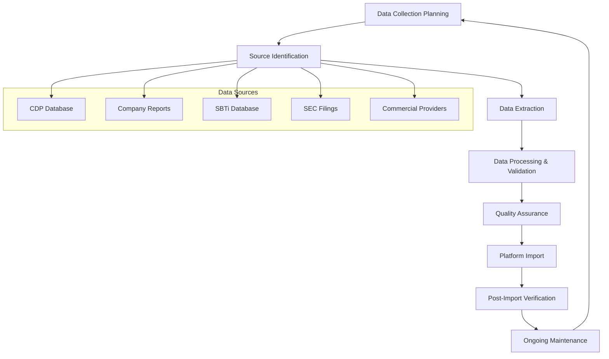

# Data Import Process Flow Documentation

## Overview

This document outlines the comprehensive data import process flow for GoCarbonTracker, from initial data collection through platform integration and ongoing maintenance. The process ensures high-quality, verified corporate climate data that meets enterprise standards.

## Process Architecture



## Phase 1: Data Collection Planning

### 1.1 Target Definition
**Objective**: Define scope and priorities for data collection

#### Company Universe Selection
```yaml
Primary Criteria:
  - Market capitalization: >$1B for public companies
  - Industry coverage: All major sectors represented
  - Geographic distribution: Global coverage with regional balance
  - Data availability: Publicly disclosed climate data

Secondary Criteria:
  - Sustainability leadership: SBTi committed companies
  - Industry representation: Leading companies in each sector
  - Data quality: Companies with verified emissions data
  - Update frequency: Regular disclosure practices
```

#### Industry Prioritization
1. **High-Impact Sectors**: Energy, Materials, Utilities (>50% global emissions)
2. **Technology Leaders**: Companies setting industry standards
3. **Consumer-Facing**: Brands with public climate commitments
4. **Financial Services**: Financed emissions and climate risk leaders
5. **Emerging Sectors**: Renewable energy, clean technology

### 1.2 Resource Allocation
```yaml
Team Structure:
  - Data Manager: Overall process coordination
  - Research Analysts: Data collection and validation (2-3 people)
  - Quality Specialist: Validation and scoring
  - Technical Lead: Platform integration

Timeline Planning:
  - Planning phase: 2 weeks
  - Data collection: 4-8 weeks
  - Processing & validation: 2-4 weeks
  - Platform integration: 1-2 weeks
  - Quality assurance: 1 week

Budget Allocation:
  - Personnel: 70% of budget
  - Data sources: 20% of budget
  - Technology tools: 10% of budget
```

## Phase 2: Source Identification & Access

### 2.1 Source Prioritization Matrix

| Source Type | Quality | Coverage | Cost | Update Frequency | Priority |
|-------------|---------|----------|------|------------------|----------|
| CDP Database | Very High | High | Low | Annual | 1 |
| Company Reports | High | Very High | Low | Annual | 2 |
| SBTi Database | Very High | Medium | Low | Ongoing | 3 |
| Commercial Providers | High | Very High | High | Quarterly | 4 |
| SEC Filings | Medium | High | Low | Ongoing | 5 |

### 2.2 Access Strategy

#### Free Sources (Phase 1)
```yaml
CDP Open Data Portal:
  - Access: Immediate, no registration
  - Coverage: 13,000+ companies summary data
  - Limitations: Limited detail, annual updates only
  - Best for: Initial data collection and screening

Company Sustainability Reports:
  - Access: Company websites and investor relations
  - Coverage: All public companies (varies by disclosure)
  - Limitations: Manual collection, varying formats
  - Best for: Detailed company-specific information

SBTi Public Database:
  - Access: Immediate via website and API
  - Coverage: 4,000+ companies with targets
  - Limitations: Target-focused, limited emissions data
  - Best for: Science-based target validation
```

#### Commercial Sources (Phase 2)
```yaml
Refinitiv ESG Database:
  - Access: Enterprise subscription required
  - Coverage: 10,000+ companies, standardized metrics
  - Cost: $50,000-200,000/year
  - Best for: Broad coverage and consistency

MSCI ESG Research:
  - Access: Institutional subscription
  - Coverage: 8,500+ companies with ratings
  - Cost: $30,000-150,000/year
  - Best for: Risk assessment and scoring

Sustainalytics:
  - Access: Professional subscription
  - Coverage: 12,000+ companies
  - Cost: $25,000-100,000/year
  - Best for: Forward-looking risk analysis
```

## Phase 3: Data Extraction

### 3.1 Automated Collection

#### API Integration
```python
# CDP API Integration Example
import requests
import pandas as pd

def get_cdp_data(company_list):
    """Extract CDP data via API"""
    api_key = "your_cdp_api_key"
    base_url = "https://api.cdp.net/v1/"
    
    headers = {
        "Authorization": f"Bearer {api_key}",
        "Content-Type": "application/json"
    }
    
    results = []
    for company in company_list:
        response = requests.get(
            f"{base_url}companies/{company}/climate",
            headers=headers
        )
        if response.status_code == 200:
            results.append(response.json())
    
    return pd.DataFrame(results)
```

#### Web Scraping (Company Reports)
```python
import requests
from bs4 import BeautifulSoup
import PyPDF2

def extract_sustainability_report(company_url):
    """Extract sustainability metrics from company reports"""
    
    # Download sustainability report
    report_response = requests.get(company_url)
    
    # Parse PDF content
    with open("temp_report.pdf", "wb") as f:
        f.write(report_response.content)
    
    # Extract emissions data using regex patterns
    emissions_patterns = {
        'scope1': r'Scope 1.*?(\d+(?:,\d+)*)\s*tCO2e',
        'scope2': r'Scope 2.*?(\d+(?:,\d+)*)\s*tCO2e',
        'scope3': r'Scope 3.*?(\d+(?:,\d+)*)\s*tCO2e'
    }
    
    # Process and return structured data
    return extract_emissions_data(emissions_patterns)
```

### 3.2 Manual Collection Process

#### Company Report Analysis
1. **Report Identification**: Locate latest sustainability/annual reports
2. **Section Navigation**: Find climate/emissions sections
3. **Data Extraction**: Use standardized extraction templates
4. **Quality Verification**: Cross-check multiple sources
5. **Documentation**: Record source URLs and extraction dates

#### Quality Checklist for Manual Collection
```yaml
Source Verification:
  - [ ] Official company website/investor relations
  - [ ] Latest report (within 1 year)
  - [ ] Verified/audited data preferred
  - [ ] Consistent methodology noted

Data Extraction:
  - [ ] All scope emissions captured
  - [ ] Units clearly identified (tCO2e)
  - [ ] Reporting year noted
  - [ ] Verification status recorded
  - [ ] Calculation methodology documented

Documentation:
  - [ ] Source URL recorded
  - [ ] Extraction date noted
  - [ ] Data quality assessment
  - [ ] Cross-reference sources identified
```

## Phase 4: Data Processing & Standardization

### 4.1 Data Normalization

#### Unit Standardization
```python
def standardize_emissions_units(value, unit):
    """Convert all emissions to tCO2e"""
    
    conversion_factors = {
        'tCO2e': 1.0,
        'ktCO2e': 1000.0,
        'MtCO2e': 1000000.0,
        'tCO2': 1.0,  # Assume CO2e if not specified
        'metric tons CO2e': 1.0,
        'tonnes CO2e': 1.0
    }
    
    if unit in conversion_factors:
        return value * conversion_factors[unit]
    else:
        raise ValueError(f"Unknown unit: {unit}")
```

#### Data Type Conversion
```python
def normalize_company_data(raw_data):
    """Standardize company data format"""
    
    normalized = {
        'company_id': clean_company_id(raw_data['name']),
        'company_name': raw_data['name'].strip(),
        'industry': map_to_taxonomy(raw_data['industry']),
        'sector': map_to_taxonomy(raw_data['sector']),
        'headquarters_country': standardize_country(raw_data['country']),
        'founded_year': parse_year(raw_data['founded']),
        'employee_count_range': categorize_employees(raw_data['employees']),
        'revenue_range_usd': categorize_revenue(raw_data['revenue']),
        'data_quality_score': calculate_quality_score(raw_data),
        'last_updated': datetime.now().isoformat(),
        'data_source': raw_data['source']
    }
    
    return normalized
```

### 4.2 Cross-Reference Validation

#### Multi-Source Comparison
```python
def cross_validate_emissions(company_id, sources):
    """Compare emissions data across multiple sources"""
    
    emissions_data = []
    for source in sources:
        data = get_emissions_from_source(company_id, source)
        if data:
            emissions_data.append({
                'source': source,
                'scope1': data['scope1'],
                'scope2': data['scope2'],
                'scope3': data.get('scope3'),
                'total': data['total'],
                'year': data['year']
            })
    
    # Calculate variance and flag outliers
    variance_analysis = analyze_variance(emissions_data)
    quality_score = calculate_cross_reference_score(variance_analysis)
    
    return {
        'validated_data': select_best_data(emissions_data),
        'quality_score': quality_score,
        'variance_report': variance_analysis
    }
```

## Phase 5: Quality Assurance

### 5.1 Automated Validation

#### Range Validation
```python
def validate_emissions_ranges(emissions_data):
    """Validate emissions data against reasonable ranges"""
    
    validation_rules = {
        'scope1': {'min': 0, 'max': 100000000, 'outlier_threshold': 3},
        'scope2': {'min': 0, 'max': 100000000, 'outlier_threshold': 3},
        'scope3': {'min': 0, 'max': 500000000, 'outlier_threshold': 3}
    }
    
    results = []
    for scope, value in emissions_data.items():
        if scope in validation_rules:
            rules = validation_rules[scope]
            
            # Range check
            if value < rules['min'] or value > rules['max']:
                results.append({
                    'scope': scope,
                    'error': 'OUT_OF_RANGE',
                    'value': value,
                    'range': f"{rules['min']}-{rules['max']}"
                })
            
            # Outlier detection (industry-specific)
            industry_stats = get_industry_statistics(emissions_data['industry'])
            if is_outlier(value, industry_stats, rules['outlier_threshold']):
                results.append({
                    'scope': scope,
                    'warning': 'POTENTIAL_OUTLIER',
                    'value': value,
                    'industry_median': industry_stats['median']
                })
    
    return results
```

#### Mathematical Consistency
```python
def validate_mathematical_consistency(emissions_data):
    """Validate mathematical relationships in emissions data"""
    
    validations = []
    
    # Check if total equals sum of scopes
    calculated_total = sum([
        emissions_data.get('scope1', 0),
        emissions_data.get('scope2', 0),
        emissions_data.get('scope3', 0)
    ])
    
    reported_total = emissions_data.get('total_emissions')
    if reported_total and abs(calculated_total - reported_total) > (reported_total * 0.05):
        validations.append({
            'error': 'TOTAL_MISMATCH',
            'calculated': calculated_total,
            'reported': reported_total,
            'variance': abs(calculated_total - reported_total) / reported_total
        })
    
    # Check scope breakdown consistency
    if 'scope1_breakdown' in emissions_data:
        scope1_breakdown_total = sum(emissions_data['scope1_breakdown'].values())
        if abs(scope1_breakdown_total - emissions_data['scope1']) > (emissions_data['scope1'] * 0.05):
            validations.append({
                'error': 'SCOPE1_BREAKDOWN_MISMATCH',
                'breakdown_total': scope1_breakdown_total,
                'scope1_total': emissions_data['scope1']
            })
    
    return validations
```

### 5.2 Expert Review Process

#### Review Workflow
```yaml
Stage 1 - Automated Screening:
  - Range validation: Flag values outside reasonable bounds
  - Consistency checks: Mathematical relationship validation
  - Completeness scoring: Field population assessment
  - Cross-reference validation: Multi-source comparison

Stage 2 - Statistical Analysis:
  - Outlier detection: Industry-specific statistical analysis
  - Trend analysis: Year-over-year consistency validation
  - Peer comparison: Benchmark against similar companies
  - Pattern recognition: Identify unusual data patterns

Stage 3 - Expert Review:
  - Domain expert validation: Subject matter expert assessment
  - Source verification: Original source confirmation
  - Context evaluation: Industry and company-specific considerations
  - Quality scoring: Final quality assessment assignment

Stage 4 - Stakeholder Review:
  - Internal review: Team validation and approval
  - User feedback integration: Platform user input
  - Continuous improvement: Process refinement based on learnings
```

#### Review Criteria
```yaml
Data Accuracy (40% weight):
  - Source reliability: Primary vs secondary sources
  - Verification status: Third-party verified preferred
  - Cross-reference consistency: Multiple source alignment
  - Expert validation: Subject matter expert confirmation

Data Completeness (25% weight):
  - Field coverage: Percentage of required fields populated
  - Scope coverage: All relevant scopes included
  - Historical data: Multi-year trend availability
  - Supplementary information: Context and methodology

Data Consistency (20% weight):
  - Mathematical accuracy: Calculation verification
  - Temporal consistency: Year-over-year alignment
  - Cross-table relationships: Related data consistency
  - Industry alignment: Sector-specific validation

Data Timeliness (15% weight):
  - Reporting recency: Data age assessment
  - Update frequency: Regular disclosure practices
  - Real-time availability: Current year data presence
  - Forecast accuracy: Predictive data validation
```

## Phase 6: Platform Import

### 6.1 Import Preparation

#### Template Generation
```python
def generate_import_templates(validated_data):
    """Generate CSV templates for platform import"""
    
    templates = {
        'companies': [],
        'emissions_data': [],
        'scope1_emissions': [],
        'scope2_emissions': [],
        'scope3_emissions': [],
        'sbti_targets': [],
        'framework_compliance': []
    }
    
    for company_data in validated_data:
        # Generate company master record
        templates['companies'].append({
            'id': company_data['company_id'],
            'name': company_data['company_name'],
            'industry': company_data['industry'],
            'sector': company_data['sector'],
            'description': company_data.get('description'),
            'carbon_footprint': company_data.get('total_emissions'),
            'energy_consumption': company_data.get('energy_consumption'),
            'renewable_energy_percentage': company_data.get('renewable_percentage'),
            'last_updated': company_data['last_updated'],
            'data_source': company_data['data_source']
        })
        
        # Generate emissions records
        for year_data in company_data['emissions_by_year']:
            templates['emissions_data'].append({
                'company_id': company_data['company_id'],
                'year': year_data['year'],
                'scope1': year_data['scope1'],
                'scope2': year_data['scope2'],
                'scope3': year_data.get('scope3'),
                'created_at': datetime.now().isoformat()
            })
    
    return templates
```

#### Batch Processing
```python
def process_import_batches(templates, batch_size=100):
    """Process import in manageable batches"""
    
    import_results = {}
    
    for table_name, records in templates.items():
        batches = [records[i:i+batch_size] for i in range(0, len(records), batch_size)]
        
        import_results[table_name] = {
            'total_records': len(records),
            'total_batches': len(batches),
            'successful_batches': 0,
            'failed_batches': 0,
            'errors': []
        }
        
        for batch_index, batch in enumerate(batches):
            try:
                result = import_batch_to_supabase(table_name, batch)
                if result['success']:
                    import_results[table_name]['successful_batches'] += 1
                else:
                    import_results[table_name]['failed_batches'] += 1
                    import_results[table_name]['errors'].append({
                        'batch_index': batch_index,
                        'error': result['error']
                    })
            except Exception as e:
                import_results[table_name]['failed_batches'] += 1
                import_results[table_name]['errors'].append({
                    'batch_index': batch_index,
                    'error': str(e)
                })
    
    return import_results
```

### 6.2 Real-time Monitoring

#### Import Progress Tracking
```python
def monitor_import_progress(import_id):
    """Monitor real-time import progress"""
    
    progress_data = {
        'import_id': import_id,
        'status': 'in_progress',
        'start_time': datetime.now(),
        'tables_processed': {},
        'overall_progress': 0,
        'estimated_completion': None
    }
    
    # Real-time progress updates via WebSocket
    def update_progress(table_name, processed_records, total_records):
        progress_data['tables_processed'][table_name] = {
            'processed': processed_records,
            'total': total_records,
            'percentage': (processed_records / total_records) * 100
        }
        
        # Calculate overall progress
        total_processed = sum(t['processed'] for t in progress_data['tables_processed'].values())
        total_records = sum(t['total'] for t in progress_data['tables_processed'].values())
        progress_data['overall_progress'] = (total_processed / total_records) * 100
        
        # Estimate completion time
        elapsed_time = datetime.now() - progress_data['start_time']
        if progress_data['overall_progress'] > 0:
            estimated_total_time = elapsed_time * (100 / progress_data['overall_progress'])
            progress_data['estimated_completion'] = progress_data['start_time'] + estimated_total_time
        
        # Send real-time update to frontend
        send_websocket_update(import_id, progress_data)
    
    return update_progress
```

## Phase 7: Post-Import Verification

### 7.1 Data Integrity Validation

#### Cross-Table Consistency
```sql
-- Validate foreign key relationships
SELECT 
    'emissions_data_orphans' as check_name,
    COUNT(*) as error_count
FROM emissions_data e
LEFT JOIN companies c ON e.company_id = c.id
WHERE c.id IS NULL;

-- Validate mathematical consistency
SELECT 
    'scope_total_mismatch' as check_name,
    COUNT(*) as error_count
FROM emissions_data 
WHERE ABS((scope1 + scope2 + COALESCE(scope3, 0)) - 
          (SELECT SUM(scope1 + scope2 + COALESCE(scope3, 0)) 
           FROM emissions_data)) > 0.05;

-- Validate data completeness
SELECT 
    'incomplete_company_records' as check_name,
    COUNT(*) as error_count
FROM companies 
WHERE name IS NULL 
   OR industry IS NULL 
   OR sector IS NULL;
```

#### Statistical Validation
```python
def validate_import_statistics(import_results):
    """Validate imported data against expected statistics"""
    
    validations = []
    
    # Check company count by industry
    industry_counts = get_company_counts_by_industry()
    expected_distributions = get_expected_industry_distribution()
    
    for industry, count in industry_counts.items():
        expected_range = expected_distributions.get(industry, {'min': 0, 'max': float('inf')})
        if count < expected_range['min'] or count > expected_range['max']:
            validations.append({
                'validation': 'industry_distribution',
                'industry': industry,
                'actual_count': count,
                'expected_range': expected_range,
                'status': 'warning'
            })
    
    # Check emissions distribution
    emissions_stats = calculate_emissions_statistics()
    if emissions_stats['scope3_percentage'] < 0.6:  # Expect Scope 3 to dominate
        validations.append({
            'validation': 'scope_distribution',
            'scope3_percentage': emissions_stats['scope3_percentage'],
            'expected_minimum': 0.6,
            'status': 'warning'
        })
    
    return validations
```

### 7.2 Platform Integration Testing

#### User Interface Validation
```python
def test_platform_integration():
    """Test platform functionality with new data"""
    
    test_results = []
    
    # Test data loading
    try:
        companies = load_companies_from_database()
        test_results.append({
            'test': 'data_loading',
            'status': 'pass',
            'companies_loaded': len(companies)
        })
    except Exception as e:
        test_results.append({
            'test': 'data_loading',
            'status': 'fail',
            'error': str(e)
        })
    
    # Test search functionality
    try:
        search_results = search_companies('technology')
        test_results.append({
            'test': 'search_functionality',
            'status': 'pass',
            'results_count': len(search_results)
        })
    except Exception as e:
        test_results.append({
            'test': 'search_functionality',
            'status': 'fail',
            'error': str(e)
        })
    
    # Test visualization rendering
    try:
        chart_data = generate_sector_emissions_chart()
        test_results.append({
            'test': 'chart_rendering',
            'status': 'pass',
            'data_points': len(chart_data)
        })
    except Exception as e:
        test_results.append({
            'test': 'chart_rendering',
            'status': 'fail',
            'error': str(e)
        })
    
    return test_results
```

## Phase 8: Ongoing Maintenance

### 8.1 Regular Update Process

#### Automated Update Schedule
```yaml
Daily Updates:
  - SBTi database sync: Check for new target submissions
  - News monitoring: Track company climate announcements
  - Data quality monitoring: Automated quality score updates
  - User feedback processing: Address platform user corrections

Weekly Updates:
  - Company report monitoring: Check for new sustainability reports
  - Regulatory filing updates: Monitor SEC and other regulatory disclosures
  - Data validation review: Process flagged data quality issues
  - Performance analysis: Platform usage and data access patterns

Monthly Updates:
  - CDP data refresh: Update annual disclosure data
  - Commercial data sync: Refresh commercial provider data
  - Quality audit: Comprehensive data quality assessment
  - Process improvement: Review and optimize import processes

Annual Updates:
  - Full data refresh: Complete re-validation of all data
  - Source evaluation: Assess data source quality and cost-effectiveness
  - Technology upgrade: Update tools and infrastructure
  - Strategic review: Evaluate data strategy and expansion plans
```

#### Update Workflow Automation
```python
def automated_update_workflow():
    """Automated daily update process"""
    
    update_log = {
        'date': datetime.now().date(),
        'updates_processed': {},
        'errors': [],
        'quality_improvements': 0
    }
    
    # Check for new SBTi submissions
    try:
        new_sbti_data = check_sbti_updates()
        if new_sbti_data:
            process_sbti_updates(new_sbti_data)
            update_log['updates_processed']['sbti'] = len(new_sbti_data)
    except Exception as e:
        update_log['errors'].append(f"SBTi update failed: {e}")
    
    # Monitor company news and announcements
    try:
        news_updates = monitor_company_news()
        flagged_companies = process_news_for_data_updates(news_updates)
        update_log['updates_processed']['news_flags'] = len(flagged_companies)
    except Exception as e:
        update_log['errors'].append(f"News monitoring failed: {e}")
    
    # Process user feedback and corrections
    try:
        user_corrections = process_user_feedback()
        quality_improvements = apply_user_corrections(user_corrections)
        update_log['quality_improvements'] = quality_improvements
    except Exception as e:
        update_log['errors'].append(f"User feedback processing failed: {e}")
    
    # Generate update report
    generate_update_report(update_log)
    
    return update_log
```

### 8.2 Quality Monitoring

#### Continuous Quality Assessment
```python
def continuous_quality_monitoring():
    """Monitor data quality continuously"""
    
    quality_metrics = {}
    
    # Overall data quality score
    quality_metrics['overall_score'] = calculate_overall_quality_score()
    
    # Source-specific quality
    for source in get_data_sources():
        quality_metrics[f'{source}_quality'] = calculate_source_quality(source)
    
    # User satisfaction metrics
    quality_metrics['user_satisfaction'] = calculate_user_satisfaction()
    
    # Error rate tracking
    quality_metrics['error_rate'] = calculate_daily_error_rate()
    
    # Completeness tracking
    quality_metrics['completeness'] = calculate_data_completeness()
    
    # Generate alerts for quality degradation
    quality_alerts = []
    if quality_metrics['overall_score'] < 0.85:
        quality_alerts.append({
            'type': 'quality_degradation',
            'metric': 'overall_score',
            'value': quality_metrics['overall_score'],
            'threshold': 0.85
        })
    
    if quality_metrics['error_rate'] > 0.05:
        quality_alerts.append({
            'type': 'high_error_rate',
            'metric': 'error_rate',
            'value': quality_metrics['error_rate'],
            'threshold': 0.05
        })
    
    # Send alerts if necessary
    if quality_alerts:
        send_quality_alerts(quality_alerts)
    
    return quality_metrics, quality_alerts
```

### 8.3 Performance Optimization

#### Data Access Optimization
```sql
-- Create optimized indexes for common queries
CREATE INDEX CONCURRENTLY idx_emissions_company_year 
ON emissions_data (company_id, year DESC);

CREATE INDEX CONCURRENTLY idx_companies_industry 
ON companies (industry, sector);

CREATE INDEX CONCURRENTLY idx_sbti_targets_company 
ON sbti_targets (company_id, target_year);

-- Materialized views for common aggregations
CREATE MATERIALIZED VIEW company_emissions_summary AS
SELECT 
    c.id,
    c.name,
    c.industry,
    c.sector,
    e.year,
    e.scope1,
    e.scope2,
    e.scope3,
    (e.scope1 + e.scope2 + COALESCE(e.scope3, 0)) as total_emissions
FROM companies c
JOIN emissions_data e ON c.id = e.company_id
WHERE e.year = (SELECT MAX(year) FROM emissions_data WHERE company_id = c.id);

-- Refresh materialized views daily
SELECT cron.schedule('refresh-company-summary', '0 6 * * *', 
    'REFRESH MATERIALIZED VIEW CONCURRENTLY company_emissions_summary;');
```

#### Caching Strategy
```python
def implement_caching_strategy():
    """Implement intelligent caching for performance"""
    
    cache_config = {
        'company_data': {
            'ttl': 3600,  # 1 hour
            'strategy': 'write_through'
        },
        'emissions_data': {
            'ttl': 86400,  # 24 hours
            'strategy': 'lazy_loading'
        },
        'industry_benchmarks': {
            'ttl': 604800,  # 1 week
            'strategy': 'pre_computed'
        },
        'search_results': {
            'ttl': 1800,  # 30 minutes
            'strategy': 'write_behind'
        }
    }
    
    # Implement Redis caching layers
    for data_type, config in cache_config.items():
        setup_cache_layer(data_type, config)
    
    # Setup cache invalidation triggers
    setup_cache_invalidation_triggers()
    
    return cache_config
```

## Success Metrics & KPIs

### Data Quality KPIs
```yaml
Primary Metrics:
  - Overall Quality Score: >0.90 target
  - Data Completeness: >85% field completion
  - Cross-Reference Accuracy: >95% source agreement
  - User Satisfaction: >4.5/5.0 rating

Secondary Metrics:
  - Update Frequency: 95% data updated within 12 months
  - Error Rate: <2% validation failures
  - Processing Time: <24 hours from collection to platform
  - Cost Efficiency: Cost per validated company record

Operational Metrics:
  - Import Success Rate: >98% successful imports
  - Platform Uptime: >99.9% availability
  - Query Performance: <2 second average response time
  - Storage Efficiency: Optimal data storage utilization
```

### Business Impact KPIs
```yaml
Platform Growth:
  - Company Coverage: 500+ companies by Q2 2025
  - Industry Coverage: All major sectors represented
  - Geographic Coverage: Global representation
  - User Engagement: Daily active users growth

Data Utilization:
  - API Usage: API calls and data consumption metrics
  - Feature Adoption: Platform feature usage rates
  - Export Volume: Data export and analysis activity
  - Collaboration: Community platform engagement

Revenue Impact:
  - Customer Acquisition: New customer onboarding rate
  - Customer Retention: Platform usage retention
  - Revenue Growth: Subscription and licensing revenue
  - Cost Optimization: Data acquisition cost reduction
```

## Risk Management

### Data Quality Risks
```yaml
High-Impact Risks:
  - Source data corruption: Backup and validation procedures
  - Vendor dependency: Multi-source redundancy strategy
  - Regulatory changes: Compliance monitoring and adaptation
  - Scale limitations: Infrastructure scalability planning

Medium-Impact Risks:
  - Manual process errors: Automation and validation checks
  - Staff turnover: Documentation and knowledge transfer
  - Technology obsolescence: Regular technology updates
  - Budget constraints: Cost optimization and prioritization

Mitigation Strategies:
  - Comprehensive backup and recovery procedures
  - Multi-source data validation and cross-referencing
  - Regular process audits and improvement initiatives
  - Continuous staff training and development programs
```

## Conclusion

This comprehensive process flow ensures high-quality, reliable corporate climate data for the GoCarbonTracker platform. The systematic approach from data collection through ongoing maintenance provides enterprise-grade data management with continuous quality improvement and performance optimization.

The process is designed to scale efficiently from the current 112 companies to 500+ companies while maintaining data quality standards and platform performance. Regular monitoring, automated workflows, and continuous improvement processes ensure the platform remains current and valuable for users making critical climate-related decisions.