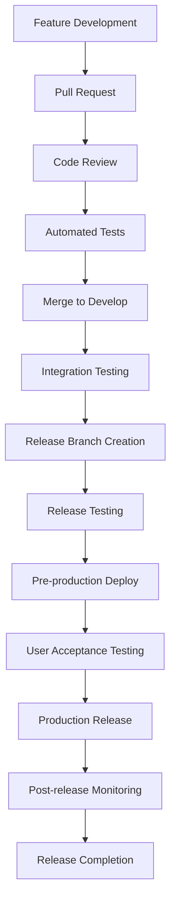

# Release Process Documentation - GoCarbonTracker

**Version**: 1.0  
**Date**: January 22, 2025  
**Owner**: Technical Team  

## 📋 Overview

This document defines the comprehensive release process for GoCarbonTracker, covering version management, deployment procedures, quality gates, and post-release monitoring to ensure reliable and controlled software releases.

## 🎯 Release Strategy

### Release Types

#### 1. Major Releases (X.0.0)
- **Frequency**: Quarterly
- **Content**: Breaking changes, major features, architecture updates
- **Timeline**: 2-week release cycle
- **Approval**: CTO and Product Owner required

#### 2. Minor Releases (X.Y.0)
- **Frequency**: Bi-weekly
- **Content**: New features, enhancements, non-breaking changes
- **Timeline**: 1-week release cycle
- **Approval**: Technical Lead required

#### 3. Patch Releases (X.Y.Z)
- **Frequency**: As needed
- **Content**: Bug fixes, security patches, minor improvements
- **Timeline**: 2-3 days
- **Approval**: Senior Developer required

#### 4. Hotfix Releases (X.Y.Z+1)
- **Frequency**: Emergency only
- **Content**: Critical bug fixes, security vulnerabilities
- **Timeline**: Same day
- **Approval**: On-call engineer + Technical Lead

### Version Management

#### Semantic Versioning (SemVer)
```
MAJOR.MINOR.PATCH[-PRERELEASE][+BUILD]

Examples:
- 1.0.0        (Major release)
- 1.1.0        (Minor release)
- 1.1.1        (Patch release)
- 1.2.0-beta.1 (Pre-release)
- 1.2.0+20250122 (Build metadata)
```

#### Version Bumping Rules
```typescript
// Automated version bumping
interface VersionBump {
  major: string[];    // Breaking changes
  minor: string[];    // New features
  patch: string[];    // Bug fixes
}

const versionRules: VersionBump = {
  major: ['BREAKING CHANGE', 'feat!', 'fix!'],
  minor: ['feat'],
  patch: ['fix', 'perf', 'refactor', 'docs', 'style', 'test', 'chore']
};
```

## 🚀 Release Pipeline

### Release Workflow



### Release Branches

#### Branch Strategy
```bash
# Create release branch
git checkout develop
git pull origin develop
git checkout -b release/v1.2.0

# Finalize release
git checkout main
git merge --no-ff release/v1.2.0
git tag -a v1.2.0 -m "Release version 1.2.0"
git push origin main --tags

# Merge back to develop
git checkout develop
git merge --no-ff release/v1.2.0
git push origin develop

# Clean up
git branch -d release/v1.2.0
git push origin --delete release/v1.2.0
```

### Automated Release Pipeline

#### GitHub Actions Workflow
```yaml
# .github/workflows/release.yml
name: Release Pipeline

on:
  push:
    branches: [main]
    tags: ['v*']

env:
  NODE_VERSION: '18'
  DOCKER_REGISTRY: ghcr.io
  IMAGE_NAME: ${{ github.repository }}

jobs:
  prepare:
    runs-on: ubuntu-latest
    outputs:
      version: ${{ steps.version.outputs.version }}
      is_release: ${{ steps.version.outputs.is_release }}
    steps:
      - uses: actions/checkout@v3
        with:
          fetch-depth: 0

      - name: Determine version
        id: version
        run: |
          if [[ $GITHUB_REF == refs/tags/v* ]]; then
            VERSION=${GITHUB_REF#refs/tags/v}
            IS_RELEASE=true
          else
            VERSION=$(npm version --no-git-tag-version patch)
            IS_RELEASE=false
          fi
          echo "version=$VERSION" >> $GITHUB_OUTPUT
          echo "is_release=$IS_RELEASE" >> $GITHUB_OUTPUT

  test:
    runs-on: ubuntu-latest
    needs: prepare
    steps:
      - uses: actions/checkout@v3

      - name: Setup Node.js
        uses: actions/setup-node@v3
        with:
          node-version: ${{ env.NODE_VERSION }}
          cache: 'npm'

      - name: Install dependencies
        run: npm ci

      - name: Run linting
        run: npm run lint

      - name: Run type checking
        run: npm run type-check

      - name: Run unit tests
        run: npm run test:coverage

      - name: Run integration tests
        run: npm run test:integration

      - name: Upload coverage
        uses: codecov/codecov-action@v3

  security:
    runs-on: ubuntu-latest
    needs: prepare
    steps:
      - uses: actions/checkout@v3

      - name: Security audit
        run: npm audit --audit-level=high

      - name: Dependency check
        uses: securecodewarrior/github-action-add-sarif@v1
        with:
          sarif-file: 'security-scan-results.sarif'

  build:
    runs-on: ubuntu-latest
    needs: [prepare, test, security]
    steps:
      - uses: actions/checkout@v3

      - name: Setup Node.js
        uses: actions/setup-node@v3
        with:
          node-version: ${{ env.NODE_VERSION }}
          cache: 'npm'

      - name: Install dependencies
        run: npm ci

      - name: Build application
        run: npm run build

      - name: Build Docker images
        run: |
          docker build -t ${{ env.DOCKER_REGISTRY }}/${{ env.IMAGE_NAME }}:${{ needs.prepare.outputs.version }} .
          docker build -t ${{ env.DOCKER_REGISTRY }}/${{ env.IMAGE_NAME }}-backend:${{ needs.prepare.outputs.version }} ./forum-service

      - name: Push Docker images
        if: needs.prepare.outputs.is_release == 'true'
        run: |
          echo ${{ secrets.GITHUB_TOKEN }} | docker login ${{ env.DOCKER_REGISTRY }} -u ${{ github.actor }} --password-stdin
          docker push ${{ env.DOCKER_REGISTRY }}/${{ env.IMAGE_NAME }}:${{ needs.prepare.outputs.version }}
          docker push ${{ env.DOCKER_REGISTRY }}/${{ env.IMAGE_NAME }}-backend:${{ needs.prepare.outputs.version }}

  deploy-staging:
    runs-on: ubuntu-latest
    needs: [prepare, build]
    environment: staging
    steps:
      - name: Deploy to staging
        run: |
          echo "Deploying version ${{ needs.prepare.outputs.version }} to staging"
          # Add staging deployment commands

      - name: Run smoke tests
        run: |
          ./scripts/smoke-tests.sh https://staging.gocarbontracker.com

  deploy-production:
    runs-on: ubuntu-latest
    needs: [prepare, build, deploy-staging]
    if: needs.prepare.outputs.is_release == 'true'
    environment: production
    steps:
      - name: Deploy to production
        run: |
          echo "Deploying version ${{ needs.prepare.outputs.version }} to production"
          # Add production deployment commands

      - name: Run post-deployment tests
        run: |
          ./scripts/post-deployment-tests.sh https://gocarbontracker.com

      - name: Update release notes
        uses: release-drafter/release-drafter@v5
        with:
          version: ${{ needs.prepare.outputs.version }}
        env:
          GITHUB_TOKEN: ${{ secrets.GITHUB_TOKEN }}

  notify:
    runs-on: ubuntu-latest
    needs: [prepare, deploy-production]
    if: always()
    steps:
      - name: Notify team
        run: |
          if [[ "${{ job.status }}" == "success" ]]; then
            ./scripts/notify-release-success.sh "${{ needs.prepare.outputs.version }}"
          else
            ./scripts/notify-release-failure.sh "${{ needs.prepare.outputs.version }}"
          fi
```

## 📋 Release Checklist

### Pre-Release Checklist

#### Technical Validation
- [ ] All automated tests pass (unit, integration, e2e)
- [ ] Code coverage meets minimum threshold (80%)
- [ ] Security scans completed without critical issues
- [ ] Performance benchmarks meet requirements
- [ ] Database migrations tested on staging
- [ ] API documentation updated
- [ ] Dependencies updated and audited

#### Quality Assurance
- [ ] Feature functionality verified on staging
- [ ] Cross-browser testing completed
- [ ] Mobile responsiveness verified
- [ ] Accessibility standards met (WCAG 2.1 AA)
- [ ] User acceptance testing completed
- [ ] Load testing performed for major releases

#### Documentation & Communication
- [ ] Release notes drafted and reviewed
- [ ] User documentation updated
- [ ] API changelog updated
- [ ] Internal team notified
- [ ] Customer communication prepared (if needed)

### Release Execution Checklist

#### Deployment Steps
- [ ] Release branch created and finalized
- [ ] Version bumped in package.json
- [ ] Git tag created with proper annotation
- [ ] Docker images built and pushed
- [ ] Staging deployment successful
- [ ] Production deployment executed
- [ ] Post-deployment tests passed

#### Verification Steps
- [ ] Application health checks passing
- [ ] Critical user journeys verified
- [ ] Database migrations applied successfully
- [ ] Monitoring and alerts functional
- [ ] Error rates within acceptable limits

### Post-Release Checklist

#### Monitoring & Validation
- [ ] Application metrics reviewed (first 30 minutes)
- [ ] Error rates monitored (first 2 hours)
- [ ] Performance metrics validated
- [ ] User feedback collected
- [ ] Support ticket volume monitored

#### Communication & Documentation
- [ ] Release announcement published
- [ ] Release notes shared with stakeholders
- [ ] Documentation updates deployed
- [ ] Team retrospective scheduled
- [ ] Next release planning initiated

## 🔧 Release Tools & Scripts

### Version Management Script
```bash
#!/bin/bash
# scripts/release.sh

set -e

RELEASE_TYPE=${1:-patch}
CURRENT_BRANCH=$(git branch --show-current)

if [ "$CURRENT_BRANCH" != "develop" ]; then
    echo "❌ Must be on develop branch to create release"
    exit 1
fi

echo "🚀 Starting $RELEASE_TYPE release process..."

# Ensure clean working directory
if [ -n "$(git status --porcelain)" ]; then
    echo "❌ Working directory not clean"
    exit 1
fi

# Pull latest changes
git pull origin develop

# Run tests
echo "🧪 Running tests..."
npm run test:all

# Bump version
echo "📝 Bumping version..."
NEW_VERSION=$(npm version $RELEASE_TYPE --no-git-tag-version)
echo "New version: $NEW_VERSION"

# Create release branch
RELEASE_BRANCH="release/$NEW_VERSION"
git checkout -b $RELEASE_BRANCH

# Commit version bump
git add package.json package-lock.json
git commit -m "chore: bump version to $NEW_VERSION"

# Push release branch
git push -u origin $RELEASE_BRANCH

echo "✅ Release branch $RELEASE_BRANCH created"
echo "Next steps:"
echo "1. Create PR from $RELEASE_BRANCH to main"
echo "2. After approval, merge and tag release"
echo "3. Deploy to production"
```

### Deployment Script
```bash
#!/bin/bash
# scripts/deploy.sh

ENVIRONMENT=${1:-staging}
VERSION=${2:-latest}

echo "🚀 Deploying version $VERSION to $ENVIRONMENT..."

case $ENVIRONMENT in
  staging)
    DEPLOY_URL="https://staging.gocarbontracker.com"
    DOCKER_COMPOSE_FILE="docker-compose.staging.yml"
    ;;
  production)
    DEPLOY_URL="https://gocarbontracker.com"
    DOCKER_COMPOSE_FILE="docker-compose.prod.yml"
    ;;
  *)
    echo "❌ Unknown environment: $ENVIRONMENT"
    exit 1
    ;;
esac

# Pre-deployment checks
echo "🔍 Running pre-deployment checks..."
./scripts/pre-deployment-checks.sh $ENVIRONMENT

# Deploy application
echo "📦 Deploying application..."
docker-compose -f $DOCKER_COMPOSE_FILE pull
docker-compose -f $DOCKER_COMPOSE_FILE up -d

# Wait for services to be ready
echo "⏳ Waiting for services to be ready..."
sleep 30

# Run health checks
echo "🏥 Running health checks..."
./scripts/health-check.sh $DEPLOY_URL

# Run smoke tests
echo "💨 Running smoke tests..."
./scripts/smoke-tests.sh $DEPLOY_URL

echo "✅ Deployment to $ENVIRONMENT completed successfully!"
```

### Rollback Script
```bash
#!/bin/bash
# scripts/rollback.sh

ENVIRONMENT=${1:-staging}
PREVIOUS_VERSION=${2}

if [ -z "$PREVIOUS_VERSION" ]; then
    echo "❌ Previous version required"
    echo "Usage: $0 <environment> <previous_version>"
    exit 1
fi

echo "🔄 Rolling back $ENVIRONMENT to version $PREVIOUS_VERSION..."

# Confirm rollback
read -p "Are you sure you want to rollback $ENVIRONMENT to $PREVIOUS_VERSION? (y/N): " confirm
if [ "$confirm" != "y" ]; then
    echo "Rollback cancelled"
    exit 0
fi

# Execute rollback
echo "📦 Rolling back application..."
case $ENVIRONMENT in
  staging)
    docker-compose -f docker-compose.staging.yml down
    docker tag gocarbon:$PREVIOUS_VERSION gocarbon:latest
    docker-compose -f docker-compose.staging.yml up -d
    ;;
  production)
    docker-compose -f docker-compose.prod.yml down
    docker tag gocarbon:$PREVIOUS_VERSION gocarbon:latest
    docker-compose -f docker-compose.prod.yml up -d
    ;;
esac

# Verify rollback
echo "🔍 Verifying rollback..."
sleep 30
./scripts/health-check.sh

echo "✅ Rollback to $PREVIOUS_VERSION completed!"
```

## 📊 Release Metrics & Monitoring

### Key Metrics

#### Release Velocity
```typescript
interface ReleaseMetrics {
  deploymentFrequency: number;     // Deployments per week
  leadTime: number;                // Hours from commit to production
  meanTimeToRecovery: number;      // Hours to fix issues
  changeFailureRate: number;       // % of releases requiring hotfix
}

// Target metrics
const targetMetrics: ReleaseMetrics = {
  deploymentFrequency: 2,          // 2 deployments per week
  leadTime: 24,                    // 24 hours max
  meanTimeToRecovery: 4,           // 4 hours max
  changeFailureRate: 5             // <5% failure rate
};
```

#### Success Criteria
```yaml
Release Success Criteria:
  Technical:
    - Zero production errors in first hour
    - Response time degradation <10%
    - Memory usage increase <20%
    - Database performance stable
  
  Business:
    - User satisfaction score >4.5/5
    - Feature adoption rate >15%
    - Support ticket increase <10%
    - Revenue impact neutral or positive
  
  Operational:
    - Deployment time <30 minutes
    - Rollback capability verified
    - Monitoring and alerts functional
    - Documentation complete
```

### Monitoring Dashboard

#### Release Health Dashboard
```typescript
// Release monitoring queries
const releaseQueries = {
  errorRate: `
    rate(http_requests_total{status_code=~"5.."}[5m]) 
    / rate(http_requests_total[5m]) * 100
  `,
  
  responseTime: `
    histogram_quantile(0.95, 
      rate(http_request_duration_seconds_bucket[5m])
    )
  `,
  
  throughput: `
    rate(http_requests_total[5m])
  `,
  
  memoryUsage: `
    process_resident_memory_bytes / 1024 / 1024
  `,
  
  activeUsers: `
    increase(user_sessions_total[1h])
  `
};
```

## 🚨 Emergency Procedures

### Hotfix Process

#### Emergency Release Workflow
```bash
#!/bin/bash
# Emergency hotfix process

echo "🚨 Emergency hotfix process initiated..."

# Create hotfix branch from main
git checkout main
git pull origin main
git checkout -b hotfix/critical-fix

# Make critical changes
echo "Make your critical changes now..."
read -p "Press enter when ready to continue..."

# Quick validation
npm run test:critical
npm run build

# Version bump (patch)
npm version patch

# Commit and push
git add .
git commit -m "hotfix: critical production fix"
git push -u origin hotfix/critical-fix

# Deploy immediately
echo "🚀 Deploying hotfix..."
./scripts/deploy.sh production $(npm version --json | jq -r '.version')

# Verify fix
echo "🔍 Verifying hotfix..."
./scripts/verify-hotfix.sh

# Merge back to main and develop
git checkout main
git merge --no-ff hotfix/critical-fix
git tag -a "v$(npm version --json | jq -r '.version')" -m "Hotfix release"
git push origin main --tags

git checkout develop
git merge --no-ff hotfix/critical-fix
git push origin develop

echo "✅ Hotfix completed!"
```

### Incident Response Integration

#### Release-Related Incident Detection
```typescript
// Automated incident detection
interface IncidentTrigger {
  metric: string;
  threshold: number;
  duration: string;
  severity: 'low' | 'medium' | 'high' | 'critical';
}

const releaseIncidentTriggers: IncidentTrigger[] = [
  {
    metric: 'error_rate',
    threshold: 5,        // >5% error rate
    duration: '5m',
    severity: 'critical'
  },
  {
    metric: 'response_time_p95',
    threshold: 2000,     // >2s response time
    duration: '10m',
    severity: 'high'
  },
  {
    metric: 'memory_usage',
    threshold: 90,       // >90% memory usage
    duration: '15m',
    severity: 'medium'
  }
];
```

## 📝 Release Communication

### Release Notes Template

#### Standard Release Notes
```markdown
# Release v1.2.0 - Feature Enhancement Release

**Release Date**: January 22, 2025  
**Release Type**: Minor Release  
**Deployment Window**: 2:00 PM - 3:00 PM EST  

## 🎉 New Features
- **Dashboard Improvements**: Enhanced emissions visualization with new chart types
- **User Authentication**: Added single sign-on (SSO) support
- **API Enhancements**: New endpoints for emissions data export

## 🐛 Bug Fixes
- Fixed issue with chart rendering on mobile devices
- Resolved memory leak in data processing
- Corrected timezone handling for international users

## 🔧 Technical Improvements
- Updated to React 18.3
- Improved database query performance by 30%
- Enhanced error handling and logging

## 📊 Performance Impact
- Page load time improved by 15%
- Memory usage reduced by 20%
- Database query time decreased by 30%

## 🔄 Migration Notes
- No breaking changes
- Automatic database migration will run during deployment
- No user action required

## 📋 Rollback Plan
- Rollback available within 4 hours
- Previous version: v1.1.5
- Rollback contact: [on-call engineer]

## 🆘 Support
- Documentation: [link to docs]
- Support: [support contact]
- Status Page: [status page link]
```

### Stakeholder Communication

#### Release Announcement Template
```markdown
Subject: GoCarbonTracker Release v1.2.0 - Enhanced Dashboard Features

Dear Team,

We're excited to announce the release of GoCarbonTracker v1.2.0, featuring significant improvements to our dashboard and user experience.

**Key Highlights:**
• New visualization options for emissions data
• Improved mobile experience
• Enhanced performance across the platform

**Timeline:**
• Deployment: Today, 2:00 PM - 3:00 PM EST
• Expected Impact: <5 minutes downtime
• Verification: Complete by 3:30 PM EST

**What to Expect:**
• Users may experience brief interruption during deployment
• All data and user accounts remain safe
• New features available immediately after deployment

**Need Help?**
• Documentation: [link]
• Support Team: [contact]
• Status Updates: [status page]

Thank you for your continued support!

Best regards,
GoCarbonTracker Team
```

---

**Last Updated**: January 22, 2025  
**Version**: 1.0  
**Maintained by**: Technical Team

This release process ensures consistent, reliable, and safe deployments while maintaining high quality standards and effective communication throughout the organization.