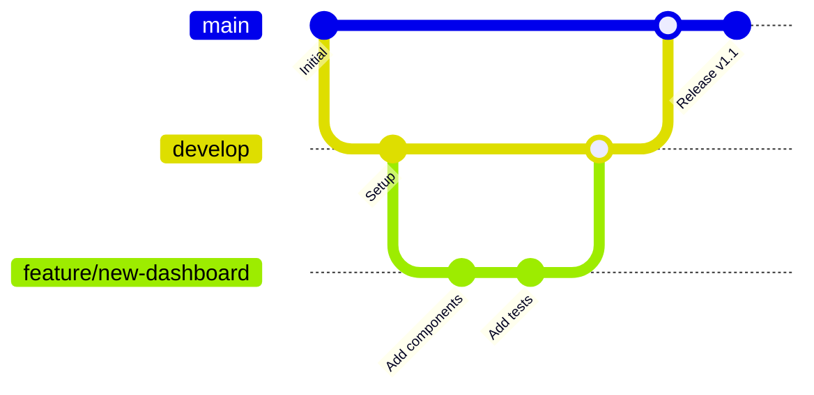

# Git Workflow & Branching Strategy - GoCarbonTracker

**Version**: 1.0  
**Date**: January 22, 2025  
**Owner**: Technical Team  

## 📋 Overview

This document defines the Git workflow, branching strategy, and best practices for GoCarbonTracker development. Our workflow is designed to support continuous integration, code quality, and collaborative development.

## 🌳 Branching Strategy

### Branch Types

#### Main Branches
- **`main`**: Production-ready code, always deployable
- **`develop`**: Integration branch for feature development

#### Supporting Branches
- **`feature/*`**: New features and enhancements
- **`bugfix/*`**: Bug fixes for develop branch
- **`hotfix/*`**: Critical fixes for production
- **`release/*`**: Preparing new releases

### Branch Naming Conventions

```
feature/emission-tracking-dashboard
feature/user-authentication
bugfix/chart-rendering-issue
hotfix/security-vulnerability
release/v1.2.0
```

#### Naming Rules
- Use lowercase with hyphens
- Be descriptive but concise
- Include issue number when applicable: `feature/123-user-dashboard`
- Use consistent prefixes

## 🔄 Git Flow Process

### Feature Development Workflow



#### 1. Starting a New Feature
```bash
# Ensure you're on develop
git checkout develop
git pull origin develop

# Create feature branch
git checkout -b feature/emission-tracking-dashboard

# Push branch to remote
git push -u origin feature/emission-tracking-dashboard
```

#### 2. Working on Feature
```bash
# Make changes
git add .
git commit -m "feat: add emission tracking dashboard"

# Push changes regularly
git push origin feature/emission-tracking-dashboard

# Keep feature branch updated
git checkout develop
git pull origin develop
git checkout feature/emission-tracking-dashboard
git merge develop
```

#### 3. Completing Feature
```bash
# Final commit
git add .
git commit -m "feat: complete emission tracking dashboard with tests"

# Push final changes
git push origin feature/emission-tracking-dashboard

# Create pull request to develop
# After approval and merge, clean up
git checkout develop
git pull origin develop
git branch -d feature/emission-tracking-dashboard
git push origin --delete feature/emission-tracking-dashboard
```

### Release Workflow

#### 1. Starting a Release
```bash
# Create release branch from develop
git checkout develop
git pull origin develop
git checkout -b release/v1.2.0

# Update version numbers
npm version minor
git add package.json package-lock.json
git commit -m "bump version to 1.2.0"

# Push release branch
git push -u origin release/v1.2.0
```

#### 2. Release Testing & Bug Fixes
```bash
# Fix any issues found during testing
git add .
git commit -m "fix: resolve login issue in production build"

# Push fixes
git push origin release/v1.2.0
```

#### 3. Completing Release
```bash
# Merge to main
git checkout main
git pull origin main
git merge --no-ff release/v1.2.0

# Tag the release
git tag -a v1.2.0 -m "Release version 1.2.0"
git push origin main --tags

# Merge back to develop
git checkout develop
git merge --no-ff release/v1.2.0
git push origin develop

# Delete release branch
git branch -d release/v1.2.0
git push origin --delete release/v1.2.0
```

### Hotfix Workflow

#### 1. Starting a Hotfix
```bash
# Create hotfix branch from main
git checkout main
git pull origin main
git checkout -b hotfix/security-patch

# Make critical fix
git add .
git commit -m "fix: patch security vulnerability CVE-2024-1234"
```

#### 2. Completing Hotfix
```bash
# Bump patch version
npm version patch
git add package.json package-lock.json
git commit -m "bump version to 1.2.1"

# Merge to main
git checkout main
git merge --no-ff hotfix/security-patch

# Tag the hotfix
git tag -a v1.2.1 -m "Hotfix version 1.2.1"
git push origin main --tags

# Merge to develop
git checkout develop
git merge --no-ff hotfix/security-patch
git push origin develop

# Clean up
git branch -d hotfix/security-patch
git push origin --delete hotfix/security-patch
```

## 📝 Commit Message Standards

### Conventional Commits Format
```
<type>(<scope>): <description>

[optional body]

[optional footer(s)]
```

### Commit Types
- **feat**: New feature
- **fix**: Bug fix
- **docs**: Documentation changes
- **style**: Code formatting (no functional changes)
- **refactor**: Code refactoring
- **test**: Adding or updating tests
- **chore**: Maintenance tasks

### Examples
```bash
# Feature commits
git commit -m "feat(dashboard): add emission trend chart"
git commit -m "feat(auth): implement social login with Google"

# Bug fix commits
git commit -m "fix(api): resolve data validation error"
git commit -m "fix(ui): correct responsive layout on mobile"

# Documentation commits
git commit -m "docs: update API documentation"
git commit -m "docs(readme): add installation instructions"

# Multiple lines for complex changes
git commit -m "feat(emissions): add carbon intensity calculations

- Add calculation for Scope 1, 2, 3 intensities
- Include industry benchmarking data
- Add validation for input parameters

Closes #123"
```

### Commit Message Rules
1. **Subject line**: 50 characters or less
2. **Body**: Wrap at 72 characters
3. **Imperative mood**: "Add feature" not "Added feature"
4. **Reference issues**: Include issue numbers
5. **Breaking changes**: Note in footer with "BREAKING CHANGE:"

## 🔀 Pull Request Process

### PR Creation Checklist
- [ ] Branch is up to date with target branch
- [ ] All tests pass locally
- [ ] Code follows style guidelines
- [ ] Documentation updated if needed
- [ ] Clear, descriptive PR title
- [ ] Comprehensive PR description

### PR Title Format
```
feat(dashboard): add real-time emission monitoring
fix(auth): resolve token refresh issue
docs: update deployment guide
```

### PR Description Template
```markdown
## Description
Brief summary of changes and motivation

## Type of Change
- [ ] Bug fix
- [ ] New feature
- [ ] Breaking change
- [ ] Documentation update

## Changes Made
- Specific change 1
- Specific change 2

## Testing
- [ ] Unit tests added/updated
- [ ] Integration tests pass
- [ ] Manual testing completed

## Screenshots (if applicable)
[Add screenshots for UI changes]

## Related Issues
Closes #123
```

### Review Process
1. **Automated checks**: CI/CD pipeline runs
2. **Code review**: At least one approval required
3. **Testing**: All tests must pass
4. **Documentation**: Updates must be included
5. **Merge**: Squash and merge for features

## 🔄 Git Hooks

### Pre-commit Hooks
```bash
# Install husky
npm install --save-dev husky

# Setup husky
npx husky install
npm pkg set scripts.prepare="husky install"

# Add pre-commit hook
npx husky add .husky/pre-commit "npm run pre-commit"
```

### Pre-commit Script
```json
{
  "scripts": {
    "pre-commit": "lint-staged && npm run test:changed"
  },
  "lint-staged": {
    "*.{ts,tsx,js,jsx}": [
      "eslint --fix",
      "prettier --write"
    ],
    "*.{css,scss,md}": [
      "prettier --write"
    ]
  }
}
```

### Commit Message Validation
```bash
# Add commit-msg hook
npx husky add .husky/commit-msg 'npx --no -- commitlint --edit ${1}'

# Install commitlint
npm install --save-dev @commitlint/config-conventional @commitlint/cli

# Configure commitlint
echo "module.exports = {extends: ['@commitlint/config-conventional']}" > commitlint.config.js
```

## 🔧 Git Configuration

### Global Git Settings
```bash
# User configuration
git config --global user.name "Your Name"
git config --global user.email "your.email@example.com"

# Editor configuration
git config --global core.editor "code --wait"

# Default branch name
git config --global init.defaultBranch main

# Auto-setup remote tracking
git config --global push.autoSetupRemote true

# Better diff output
git config --global diff.algorithm patience
git config --global diff.compactionHeuristic true
```

### Repository-specific Settings
```bash
# Line ending configuration
git config core.autocrlf false
git config core.eol lf

# Case sensitivity
git config core.ignorecase false

# Merge strategy
git config merge.ours.driver true
```

### Useful Git Aliases
```bash
# Add to ~/.gitconfig
[alias]
    st = status
    co = checkout
    br = branch
    ci = commit
    ca = commit -a
    cm = commit -m
    cam = commit -am
    lg = log --oneline --graph --decorate --all
    last = log -1 HEAD
    unstage = reset HEAD --
    visual = !gitk
    amend = commit --amend --no-edit
    pushf = push --force-with-lease
    save = stash push -m
    pop = stash pop
    cleanup = "!git branch --merged | grep -v '\\*\\|main\\|develop' | xargs -n 1 git branch -d"
```

## 📊 Branch Management

### Protection Rules

#### Main Branch Protection
```yaml
# GitHub branch protection settings
protection_rules:
  main:
    required_status_checks:
      strict: true
      contexts:
        - build
        - test
        - lint
        - security-scan
    required_pull_request_reviews:
      required_approving_review_count: 2
      dismiss_stale_reviews: true
      require_code_owner_reviews: true
    enforce_admins: true
    allow_force_pushes: false
    allow_deletions: false
```

#### Develop Branch Protection
```yaml
develop:
  required_status_checks:
    strict: true
    contexts:
      - build
      - test
      - lint
  required_pull_request_reviews:
    required_approving_review_count: 1
    dismiss_stale_reviews: true
  enforce_admins: false
  allow_force_pushes: false
  allow_deletions: false
```

### Branch Cleanup

#### Automated Cleanup
```bash
#!/bin/bash
# cleanup-branches.sh

echo "Cleaning up merged branches..."

# Switch to main
git checkout main
git pull origin main

# Delete merged branches (except main and develop)
git branch --merged | grep -v "\*\|main\|develop" | xargs -n 1 git branch -d

# Clean up remote tracking branches
git remote prune origin

echo "Cleanup complete!"
```

#### Manual Cleanup Commands
```bash
# List merged branches
git branch --merged main

# Delete specific branch
git branch -d feature/old-feature

# Delete remote branch
git push origin --delete feature/old-feature

# Prune remote tracking branches
git remote prune origin

# Clean up local references
git gc --prune=now
```

## 🚨 Emergency Procedures

### Reverting Changes

#### Revert Last Commit
```bash
# Revert last commit (creates new commit)
git revert HEAD

# Revert specific commit
git revert abc1234

# Revert merge commit
git revert -m 1 abc1234
```

#### Reset to Previous State
```bash
# Soft reset (keeps changes staged)
git reset --soft HEAD~1

# Mixed reset (keeps changes unstaged)
git reset HEAD~1

# Hard reset (destroys changes)
git reset --hard HEAD~1

# Reset to specific commit
git reset --hard abc1234
```

### Recovering Lost Work

#### Using Reflog
```bash
# View reflog
git reflog

# Recover lost commit
git checkout abc1234

# Create branch from lost commit
git checkout -b recovery-branch abc1234
```

#### Recovering Deleted Branch
```bash
# Find deleted branch in reflog
git reflog | grep branch-name

# Recover branch
git checkout -b branch-name abc1234
```

## 📈 Git Metrics & Analysis

### Repository Statistics
```bash
# Contribution statistics
git shortlog -sn

# File change frequency
git log --pretty=format: --name-only | sort | uniq -c | sort -rg

# Lines of code by author
git log --author="Author Name" --pretty=tformat: --numstat | awk '{ add += $1; subs += $2; loc += $1 - $2 } END { printf "added lines: %s, removed lines: %s, total lines: %s\n", add, subs, loc }'

# Commit activity by day
git log --pretty=format:"%cd" --date=short | sort | uniq -c
```

### Code Quality Metrics
```bash
# Files with most changes
git log --pretty=format: --name-only | sort | uniq -c | sort -rg | head -10

# Largest commits
git log --pretty=format:"%h %s" --stat | grep -E "files? changed" | sort -k4 -nr | head -10

# Commit message analysis
git log --pretty=format:"%s" | grep -E "^(feat|fix|docs|style|refactor|test|chore)" | wc -l
```

## 🔍 Troubleshooting Git Issues

### Common Problems

#### Merge Conflicts
```bash
# View conflict status
git status

# Open merge tool
git mergetool

# Abort merge
git merge --abort

# Continue after resolving
git commit
```

#### Detached HEAD
```bash
# Check current state
git status

# Create branch from detached HEAD
git checkout -b new-branch-name

# Return to main branch
git checkout main
```

#### Wrong Commit Message
```bash
# Amend last commit message
git commit --amend

# Change older commit message
git rebase -i HEAD~3
# Change 'pick' to 'reword' for commits to edit
```

## 📚 Best Practices

### Daily Workflow
1. **Start of day**: Pull latest changes
2. **Feature work**: Create feature branch
3. **Regular commits**: Small, logical commits
4. **End of day**: Push work to remote
5. **Code review**: Create PR when ready

### Code Organization
- Keep commits atomic and focused
- Write descriptive commit messages
- Regularly rebase feature branches
- Clean up commit history before merging
- Use conventional commit format

### Collaboration
- Communicate branch intentions
- Review code thoroughly
- Respect branch protection rules
- Keep branches short-lived
- Document significant changes

---

**Last Updated**: January 22, 2025  
**Version**: 1.0  
**Maintained by**: Technical Team

This workflow evolves with team needs and project growth. Regular reviews ensure it remains effective and efficient.