# 📖 Reference Documentation

**Technical specifications, configurations, and comprehensive reference materials**

## Technical Reference

### **System Architecture & Design**
- [**System Architecture**](./SYSTEM_ARCHITECTURE.md) - Complete technical architecture with diagrams
- [**User Journeys**](./USER_JOURNEYS.md) - User experience flows and interaction patterns
- [**Visual Documentation Guide**](./VISUAL_DOCUMENTATION_GUIDE.md) - Screenshot capture and visual asset management

### **API & Integration Reference**
- [**API Documentation**](./API_DOCUMENTATION.md) - Complete REST API reference with authentication
- [**Advanced Configuration**](./ADVANCED_CONFIGURATION.md) - Deep technical configuration options
- [**Database Migrations**](./DATABASE_MIGRATIONS.md) - Database schema changes and migration procedures

## Architecture Documentation

### **System Overview**

```mermaid
graph TB
    Users[👥 Users] --> Frontend[⚛️ React Frontend]
    Frontend --> Backend[🗄️ Supabase Backend]
    Backend --> Database[(🐘 PostgreSQL)]
    Frontend --> CDN[📡 CDN Assets]
```


### **Key Architectural Patterns**
- **Frontend**: React 18 + TypeScript + Vite
- **Backend**: Supabase (PostgreSQL + Real-time + Auth)
- **State Management**: TanStack Query + React Context
- **UI Framework**: shadcn/ui + Tailwind CSS
- **Data Visualization**: Recharts + Custom components

### **Performance Architecture**
- **Caching**: Multi-layer caching strategy
- **Code Splitting**: Route-based and component-based
- **Lazy Loading**: Images and non-critical components
- **CDN**: Global asset distribution
- **Database**: Optimized queries with indexes

## Configuration Reference

### **Environment Variables**

#### **Required Configuration**
```bash
# Supabase Configuration
VITE_SUPABASE_URL=https://your-project.supabase.co
VITE_SUPABASE_ANON_KEY=your_anon_key_here
```

#### **Optional Configuration**
```bash
# Feature Flags
VITE_ENABLE_ANALYTICS=true
VITE_ENABLE_DEMO_MODE=true
VITE_ENABLE_EXPERIMENTAL_FEATURES=false

# Performance Settings
VITE_LAZY_LOADING=true
VITE_CACHE_DURATION=300000
VITE_MAX_CONCURRENT_REQUESTS=5

# Security Settings
VITE_FORCE_HTTPS=true
VITE_CSP_ENABLED=true
VITE_API_RATE_LIMIT=1000
```

### **Build Configuration**
```typescript
// vite.config.ts - Key configuration options
export default defineConfig({
  build: {
    target: 'es2020',
    rollupOptions: {
      output: {
        manualChunks: {
          'vendor-react': ['react', 'react-dom'],
          'vendor-ui': ['@radix-ui/*'],
          'vendor-data': ['@supabase/supabase-js'],
        }
      }
    }
  }
});
```

## Data Reference

### **Database Schema Overview**
- **Companies**: Core company information and metadata
- **Scope 1/2/3 Emissions**: Detailed emissions data by scope
- **Industries**: Industry classification and taxonomy
- **SBTi Targets**: Science-based targets and validation status
- **User Profiles**: User accounts and preferences

### **Data Quality Framework**
- **Quality Scores**: 0.0-1.0 scale indicating data reliability
- **Data Sources**: CDP, company reports, SBTi database, SEC filings
- **Validation Rules**: Automated checks for data consistency
- **Update Frequency**: Real-time UI updates, annual data refreshes

### **API Endpoints Summary**
```bash
# Core Data Endpoints
GET /companies              # List all companies
GET /companies/{id}         # Get specific company
GET /scope1_emissions       # Scope 1 emissions data
GET /scope2_emissions       # Scope 2 emissions data
GET /scope3_emissions       # Scope 3 emissions data
GET /industries            # Industry classifications
```

## Strategy & Planning Reference

### **Product Strategy**
- [**SaaS Platform Strategy**](./SAAS_PLATFORM_STRATEGY.md) - Long-term platform vision and roadmap
- [**Brownfield Architecture**](./BROWNFIELD_ARCHITECTURE.md) - Legacy system integration patterns
- [**AI Agent Ideas**](./AI_AGENT_IDEAS.md) - Future AI and automation capabilities

### **Development Roadmap**
- **Phase 1**: Core platform and data foundation
- **Phase 2**: Advanced analytics and AI features  
- **Phase 3**: Enterprise integrations and scaling
- **Phase 4**: Global expansion and partnerships

## Standards & Conventions

### **Code Standards**
- **TypeScript**: Strict mode with comprehensive typing
- **React**: Functional components with hooks
- **Styling**: Tailwind CSS with consistent design tokens
- **Testing**: Unit, integration, and E2E test coverage

### **Documentation Standards**
- **Markdown**: GitHub-flavored markdown for all docs
- **Diagrams**: Mermaid.js for technical diagrams
- **Screenshots**: 1920x1080 PNG format with annotations
- **API Docs**: OpenAPI specification compliance

### **Performance Standards**
- **Page Load**: <2 seconds first load, <1 second cached
- **API Response**: <500ms for data queries
- **Database**: <100ms average query execution
- **Uptime**: 99.9% availability target

## Troubleshooting Reference

### **Common Issues & Solutions**
- **Build Failures**: Clear cache and reinstall dependencies
- **API Errors**: Check authentication and rate limiting
- **Performance Issues**: Enable lazy loading and caching
- **Database Timeouts**: Optimize queries and add indexes

### **Debug Procedures**
```bash
# Development debugging
npm run dev -- --debug
npm run test -- --verbose
npm run build -- --mode development

# Production debugging
curl -f https://yourdomain.com/health
docker logs container_name
grep -i error /var/log/application.log
```

## Version History & Migration

### **Current Version**: 1.2.0
- Enhanced community forum features
- Improved authentication system
- Advanced content management
- Performance optimizations

### **Migration Guides**
- Database schema updates and migration scripts
- Configuration changes and breaking changes
- API version compatibility and deprecations
- Feature flag transitions and rollout procedures

## External References

### **Technology Documentation**
- [React Documentation](https://react.dev/)
- [Supabase Documentation](https://supabase.com/docs)
- [Tailwind CSS Documentation](https://tailwindcss.com/docs)
- [Vite Documentation](https://vitejs.dev/)

### **Climate Data Standards**
- [GHG Protocol](https://ghgprotocol.org/) - Greenhouse gas accounting standards
- [SBTi Guidelines](https://sciencebasedtargets.org/) - Science-based target methodology
- [CDP Framework](https://www.cdp.net/) - Climate disclosure standards
- [TCFD Recommendations](https://www.fsb-tcfd.org/) - Climate risk reporting

### **Industry Resources**
- [UNFCCC](https://unfccc.int/) - UN Framework Convention on Climate Change
- [IPCC Reports](https://www.ipcc.ch/) - Intergovernmental Panel on Climate Change
- [IEA Data](https://www.iea.org/) - International Energy Agency statistics
- [Climate Action Tracker](https://climateactiontracker.org/) - Global climate policy analysis

---
*This reference documentation is maintained alongside the codebase. For updates or corrections, please contribute via the standard development workflow.*