# 🗺️ User Journey Flowcharts

**Visual guide to user experiences and workflows in GoCarbonTracker**

## Primary User Personas

### 👤 **ESG Analyst** - Investment Research Focus
### 🏢 **Corporate Sustainability Manager** - Internal Benchmarking
### 🎓 **Academic Researcher** - Climate Data Analysis
### 💼 **Policy Maker** - Industry Oversight

---

## 🚀 New User Onboarding Journey

```mermaid
flowchart TD
    Start([🌐 User Visits Platform]) --> Landing{First Time Visitor?}
    
    Landing -->|Yes| Welcome[👋 Welcome Landing Page]
    Landing -->|No| DirectLogin[🔑 Direct Login]
    
    Welcome --> Options{How to Explore?}
    
    Options -->|Quick Demo| DemoBtn[🎯 Click Demo Button]
    Options -->|Sign Up| Register[📝 Registration Form]
    Options -->|Learn More| About[📖 About Platform]
    
    DemoBtn --> DemoLogin[🔑 Auto Demo Login]
    Register --> EmailVerify[📧 Email Verification]
    About --> Options
    
    DemoLogin --> Dashboard[📊 Dashboard View]
    EmailVerify --> Profile[👤 Profile Setup]
    DirectLogin --> Auth{Authenticated?}
    
    Auth -->|Yes| Dashboard
    Auth -->|No| LoginForm[🔑 Login Form]
    LoginForm --> Dashboard
    
    Profile --> Onboarding[🎓 Feature Walkthrough]
    Onboarding --> Dashboard
    
    Dashboard --> FirstUse[✨ First-time User Experience]
    FirstUse --> Explore[🔍 Explore Features]
    
    style Start fill:#e3f2fd
    style Dashboard fill:#e8f5e8
    style DemoBtn fill:#fff3e0
    style Explore fill:#f3e5f5
```

### **Onboarding Steps Detail**
1. **Landing Page** (0-30 seconds)
   - Value proposition clearly stated
   - Demo button prominently displayed
   - Sign-up option available

2. **Demo Experience** (30 seconds - 2 minutes)
   - Instant access with pre-populated data
   - Guided tooltips on key features
   - No registration required

3. **Feature Discovery** (2-10 minutes)
   - Interactive dashboard exploration
   - Guided tour of core capabilities
   - Sample data analysis workflows

---

## 📊 Data Analysis Workflow

```mermaid
flowchart LR
    subgraph "Discovery Phase"
        Search[🔍 Search Companies] --> Browse[👀 Browse Results]
        Browse --> Filter[🎛️ Apply Filters]
    end
    
    subgraph "Selection Phase"
        Filter --> Select[✅ Select Company]
        Select --> Overview[📋 Company Overview]
        Overview --> Validate[✔️ Validate Data Quality]
    end
    
    subgraph "Analysis Phase"
        Validate --> ChooseScope{📊 Choose Analysis Type}
        ChooseScope -->|Direct| Scope1[📈 Scope 1 Analysis]
        ChooseScope -->|Energy| Scope2[⚡ Scope 2 Analysis]
        ChooseScope -->|Value Chain| Scope3[🔗 Scope 3 Analysis]
        ChooseScope -->|Targets| SBTi[🎯 SBTi Tracking]
    end
    
    subgraph "Insight Phase"
        Scope1 --> Benchmark[⚖️ Industry Benchmark]
        Scope2 --> Benchmark
        Scope3 --> Benchmark
        SBTi --> Benchmark
        
        Benchmark --> Trends[📈 Trend Analysis]
        Trends --> Insights[💡 Generate Insights]
    end
    
    subgraph "Action Phase"
        Insights --> Export[📁 Export Data]
        Insights --> Share[🔗 Share Results]
        Insights --> Save[💾 Save Analysis]
        Export --> Report[📄 Generate Report]
    end
    
    style Search fill:#e1f5fe
    style Benchmark fill:#e8f5e8
    style Insights fill:#fff3e0
    style Export fill:#f3e5f5
```

### **Analysis Workflow Details**

#### **Discovery Phase** (1-3 minutes)
- Global search with intelligent suggestions
- Industry and region filters
- Quality score filtering
- SBTi status filtering

#### **Selection Phase** (30 seconds - 1 minute)
- Company profile preview
- Data availability indicators
- Quality score assessment
- Recent update timestamps

#### **Analysis Phase** (5-15 minutes)
- Interactive visualizations
- Multi-year trend analysis
- Peer company comparisons
- Drill-down capabilities

#### **Action Phase** (1-5 minutes)
- Multiple export formats (CSV, PDF, JSON)
- Shareable analysis links
- Integration with external tools
- Report generation

---

## 🏢 Corporate User Journey

```mermaid
flowchart TD
    Corporate[🏢 Corporate User Login] --> Purpose{Primary Goal?}
    
    Purpose -->|Benchmark| FindCompetitors[🔍 Find Industry Peers]
    Purpose -->|Track Progress| OwnCompany[📊 Locate Own Company]
    Purpose -->|Best Practices| LearnFromLeaders[🏆 Study Leaders]
    
    FindCompetitors --> IndustryFilter[🏭 Filter by Industry]
    OwnCompany --> CompanySearch[🔎 Search Company Name]
    LearnFromLeaders --> TopPerformers[⭐ View Top Performers]
    
    IndustryFilter --> PeerList[📋 Peer Company List]
    CompanySearch --> CompanyProfile[👤 Company Profile]
    TopPerformers --> BestPractices[📚 Best Practices]
    
    PeerList --> Compare[⚖️ Compare Metrics]
    CompanyProfile --> AnalyzeGaps[🔍 Analyze Performance Gaps]
    BestPractices --> Strategies[📈 Reduction Strategies]
    
    Compare --> Insights[💡 Competitive Insights]
    AnalyzeGaps --> Insights
    Strategies --> Insights
    
    Insights --> ActionPlan[📋 Create Action Plan]
    ActionPlan --> TrackProgress[📊 Track Progress]
    TrackProgress --> Reporting[📄 Generate Reports]
    
    style Corporate fill:#e3f2fd
    style Insights fill:#e8f5e8
    style ActionPlan fill:#fff3e0
    style Reporting fill:#f3e5f5
```

---

## 🎓 Academic Research Journey

```mermaid
flowchart TD
    Researcher[🎓 Academic Researcher] --> Research{Research Type?}
    
    Research -->|Industry Study| IndustryData[🏭 Collect Industry Data]
    Research -->|Trend Analysis| HistoricalData[📈 Historical Trends]
    Research -->|Policy Impact| PolicyData[📊 Policy Effectiveness]
    
    IndustryData --> IndustryFilter[🎛️ Filter by Sectors]
    HistoricalData --> YearRange[📅 Select Year Range]
    PolicyData --> RegionFilter[🌍 Filter by Region]
    
    IndustryFilter --> BulkExport[📦 Bulk Data Export]
    YearRange --> TrendAnalysis[📈 Trend Analysis]
    RegionFilter --> PolicyAnalysis[📊 Policy Analysis]
    
    BulkExport --> DataProcessing[⚙️ Data Processing]
    TrendAnalysis --> StatAnalysis[📊 Statistical Analysis]
    PolicyAnalysis --> ImpactAssessment[📋 Impact Assessment]
    
    DataProcessing --> AcademicFindings[📚 Academic Findings]
    StatAnalysis --> AcademicFindings
    ImpactAssessment --> AcademicFindings
    
    AcademicFindings --> Publication[📝 Research Publication]
    AcademicFindings --> Presentation[🎤 Conference Presentation]
    AcademicFindings --> Dataset[📊 Public Dataset]
    
    style Researcher fill:#e3f2fd
    style AcademicFindings fill:#e8f5e8
    style Publication fill:#fff3e0
```

---

## 🔍 Feature Discovery Paths

### **Dashboard → Analysis Flow**

```mermaid
flowchart LR
    Dashboard[📊 Dashboard] --> StatsCard[📈 Click Stats Card]
    Dashboard --> CompanyRow[🏢 Click Company Row]
    Dashboard --> IndustryLink[🏭 Click Industry]
    
    StatsCard --> DetailView[📋 Detailed Statistics]
    CompanyRow --> CompanyAnalysis[📊 Company Analysis]
    IndustryLink --> IndustryOverview[🏭 Industry Overview]
    
    DetailView --> DrillDown[🔍 Drill Down Analysis]
    CompanyAnalysis --> ScopeAnalysis[📈 Scope Analysis]
    IndustryOverview --> Benchmarking[⚖️ Benchmarking]
    
    style Dashboard fill:#e1f5fe
    style ScopeAnalysis fill:#e8f5e8
    style Benchmarking fill:#fff3e0
```

### **Search → Results Flow**

```mermaid
flowchart LR
    Search[🔎 Global Search] --> Suggestions[💡 Auto-suggestions]
    Search --> Results[📋 Search Results]
    
    Suggestions --> QuickSelect[⚡ Quick Selection]
    Results --> FilterRefine[🎛️ Refine Filters]
    
    QuickSelect --> Analysis[📊 Immediate Analysis]
    FilterRefine --> NarrowedResults[🎯 Narrowed Results]
    
    NarrowedResults --> MultiSelect[✅ Multi-selection]
    MultiSelect --> Comparison[⚖️ Comparison View]
    
    style Search fill:#e1f5fe
    style Analysis fill:#e8f5e8
    style Comparison fill:#fff3e0
```

---

## 📱 Mobile User Experience

```mermaid
flowchart TD
    Mobile[📱 Mobile Access] --> ResponsiveCheck{Screen Size Adaptation?}
    
    ResponsiveCheck -->|Tablet| TabletUI[📄 Tablet Interface]
    ResponsiveCheck -->|Phone| PhoneUI[📱 Phone Interface]
    
    TabletUI --> SidebarCollapse[📋 Collapsible Sidebar]
    PhoneUI --> BottomNav[📍 Bottom Navigation]
    
    SidebarCollapse --> TouchOptimize[👆 Touch-optimized Controls]
    BottomNav --> SwipeGestures[👈 Swipe Gestures]
    
    TouchOptimize --> MobileCharts[📊 Mobile-friendly Charts]
    SwipeGestures --> MobileCharts
    
    MobileCharts --> MobileExport[📤 Mobile Export Options]
    MobileExport --> ShareNative[📲 Native Sharing]
    
    style Mobile fill:#e3f2fd
    style MobileCharts fill:#e8f5e8
    style ShareNative fill:#fff3e0
```

---

## ❌ Error Recovery Flows

### **Data Loading Failures**

```mermaid
flowchart TD
    LoadError[❌ Data Load Failure] --> ErrorType{Error Classification}
    
    ErrorType -->|Network| NetworkError[🌐 Network Issue]
    ErrorType -->|Auth| AuthError[🔑 Authentication Issue]
    ErrorType -->|Server| ServerError[🖥️ Server Issue]
    
    NetworkError --> RetryLogic[🔄 Automatic Retry]
    AuthError --> ReauthPrompt[🔑 Re-authentication]
    ServerError --> FallbackData[📊 Cached/Fallback Data]
    
    RetryLogic --> Success{Success?}
    ReauthPrompt --> AuthFlow[🔑 Authentication Flow]
    FallbackData --> UserNotification[📢 User Notification]
    
    Success -->|Yes| DataDisplay[📊 Display Data]
    Success -->|No| UserNotification
    AuthFlow --> DataDisplay
    
    UserNotification --> UserAction{User Action?}
    UserAction -->|Retry| RetryLogic
    UserAction -->|Contact Support| SupportChannel[🆘 Support Contact]
    
    style LoadError fill:#ffebee
    style DataDisplay fill:#e8f5e8
    style SupportChannel fill:#fff3e0
```

---

## 📊 Analytics Integration Points

### **User Behavior Tracking**

```mermaid
flowchart LR
    UserAction[👤 User Action] --> EventCapture[📊 Event Capture]
    EventCapture --> EventTypes{Event Type}
    
    EventTypes -->|Navigation| PageView[📄 Page View]
    EventTypes -->|Interaction| UserEvent[🖱️ User Interaction]
    EventTypes -->|Performance| PerfMetric[⚡ Performance Metric]
    
    PageView --> Analytics[📈 Analytics Service]
    UserEvent --> Analytics
    PerfMetric --> Monitoring[📊 Performance Monitoring]
    
    Analytics --> Insights[💡 User Insights]
    Monitoring --> Optimization[⚡ Performance Optimization]
    
    Insights --> ProductImprovements[🚀 Product Improvements]
    Optimization --> UserExperience[✨ Enhanced UX]
    
    style UserAction fill:#e1f5fe
    style Insights fill:#e8f5e8
    style ProductImprovements fill:#fff3e0
```

---

## 🔄 Feedback Loop Integration

```mermaid
flowchart TD
    UserFeedback[💬 User Feedback] --> FeedbackType{Feedback Type}
    
    FeedbackType -->|Bug Report| BugTracking[🐛 Bug Tracking]
    FeedbackType -->|Feature Request| FeatureBacklog[📋 Feature Backlog]
    FeedbackType -->|Data Quality| DataIssue[📊 Data Quality Issue]
    
    BugTracking --> PriorityAssignment[📊 Priority Assignment]
    FeatureBacklog --> RoadmapPlanning[🗺️ Roadmap Planning]
    DataIssue --> DataValidation[✅ Data Validation]
    
    PriorityAssignment --> Development[⚙️ Development Cycle]
    RoadmapPlanning --> Development
    DataValidation --> DataCorrection[🔧 Data Correction]
    
    Development --> Testing[🧪 Quality Testing]
    DataCorrection --> DataUpdate[📊 Data Update]
    
    Testing --> Release[🚀 Feature Release]
    DataUpdate --> UserNotification[📢 Update Notification]
    
    Release --> UserCommunication[📢 Release Communication]
    UserNotification --> UserValidation[✅ User Validation]
    
    style UserFeedback fill:#e3f2fd
    style Development fill:#e8f5e8
    style Release fill:#fff3e0
```

---

*These user journeys represent typical workflows and can be customized based on specific user needs and organizational requirements. The flows are designed to minimize friction while maximizing user value and engagement.*